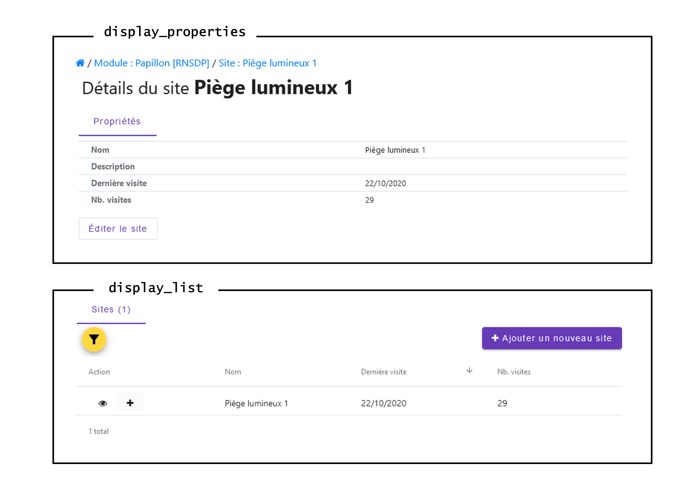

Développer un module monitorings GeoNature (Atelier du 25 mai 2023)
===================================================================

| source `Création d'un sous-module <https://github.com/PnX-SI/gn_module_monitoring/blob/master/docs/sous_module.rst>`_ (Documentation officielle du module monitorings)

--------------
Fonctionnement
--------------

Le module Monitoring est un module générique de gestion des données de protocoles de type suivis.
Il permet de générer des sous-modules (stockés dans la table gn_commons.t_modules) pour chaque protocole de suivi.

Au sein de ces sous-modules, nous retrouvons un niveaux d'information bien défini : 

- *(Facultatif)* **GROUPES DE SITES** Un groupe de sites est composé d'un ou plusieurs sites
- **SITES** (nom, type, localisation) Un site est composé d'une ou plusieurs visites
- **VISITES** (dates, observateurs) Une visite est composée d'une ou plusieurs observations
- **OBSERVATIONS** (espèce, dénombrement) Une observation est composée d'un ou plusieurs détails d'observation
- *(Facultatif)* **DETAIL DES OBSERVATIONS** Donne un détail à l'observation (permet d'ajouter un niveau supplémentaire dans la hierarchie)

Nous verrons plus en détail ces niveaux dans la partie `Configuration des niveaux <#id1>`_

.. NOTE::

    Le module est actuellement en refonte d'une partie de son modèle de données. Le fonctionnement est valable pour les versions <=0.5.0.

.. image:: _static/gn_monitoring/2020-06-MCD-monitoring.jpg
    :alt: MCD du schema gn_monitoring

-------------------------------
Installer le module Monitorings
-------------------------------

1. Télécharger le projet à la racine de de l'utilisateur de votre GeoNatre (``cd``)

::

    wget https://github.com/PnX-SI/gn_module_monitoring/archive/X.Y.Z.zip
    unzip X.Y.Z.zip

2. Installer le module

::
    
    source geonature/backend/venv/bin/activate
    geonature install-gn-module gn_module_monitoring MONITORINGS
    sudo systemctl restart geonature

--------------------
Créer un sous-module
--------------------

Pour créer un sous-module, vous devez créer un dossier `<nom_de_votre_sous_module>` dans le dossier ``/home/`whoami`/gn_module_monitoring/contrib/``. ATTENTION, le nom de ce dossier constituera le ``module_code`` dans la table `gn_commons.t_modules`.

Tous les fichiers de configuration de base sont définis dans ``/home/`whoami`/gn_module_monitoring/config/monitoring/generic``.

Vous pouvez cependant surcoucher vos propres configurations spécifiques pour votre sous-module en créant des fichiers avec les mêmes noms dans ``/home/`whoami`/gn_module_monitoring/contrib/<nom_de_votre_sous_module>/``.

Les différents fichiers : 

* ``config.json`` `(configuration générale)`
* ``module.json`` `(configuration du module)`
* ``site.json`` `(configuration des sites)`
* ``group_site.json`` `(configuration des groupes de sites)`
* ``visit.json`` `(configuration des visites)`
* ``observation.json`` `(configuration des observations)`
* ``observation_detail.json`` `(configuration des détails des observations)`
* ``nomenclature.json`` `(pour l'ajout de nomenclatures spécifiques au sous-module)`
* ``synthese.sql`` `(vue pour la synchronisation avec la synthèse)`
* ``img.jpg`` `(image/vignette qui apparaitra dans l'accueil de Monitoring)`

Configuration générale
~~~~~~~~~~~~~~~~~~~~~~~~~

Les exemples cités sont à placer dans les fichiers correspondants.

- **L'Arboresence du sous-module** ``config.json``

Un premier lieu, il convient de bien définir les niveaux que vous aller utiliser pour votre sous-module.
Voici quelques exemples ci-dessous :

¤ Structure par défaut

.. code-block:: json

    {
    "tree": {
        "module": {
            "site": {
                "visit": {
                    "observation": null
                    },
                }
            }
        }
    }

.. raw:: html

   

   
<a>Cliquez pour afficher tous les exemples</a>

¤ Struture en rajoutant le niveau `Détail de l'observation`

.. code-block:: json

    {
    "tree": {
        "module": {
            "site": {
                "visit": {
                    "observation": {
                        "observation_detail": null
                        },
                    },
                }
            }
        }
    }

¤ Struture en rajoutant le niveau `Groupe de sites`

.. code-block:: json

    {
    "tree": {
        "module": {
            "sites_group": {
                "site": {
                    "visit": {
                        "observation": {
                            "observation_detail": null
                            },
                        },
                    }
                }
            }    
        }
    }

¤ Struture en rajoutant le niveau `Groupe de sites`, sur le même niveau que les `Sites`

.. code-block:: json

    {
    "tree": {
        "module": {
            "site": {
                "visit": {
                    "observation": {
                        "observation_detail": null
                        },
                    },
                }
            }
        }
    }

.. raw:: html

   

    

- **Les Objets du module** ``module.json``

¤ Struture simple (varaibles obligatoires)

.. code-block:: json

    {
    "module_label":"Nom de votre sous-module",
    "module_desc":"Description de votre sous-module"
    }
    

- **Les Nomenclatures utilisées** ``nomenclature.json``

On peut également définir dans un fichier toutes les nomenclatures qui devront être installées pour faire fonctionner les champs de ce sous-module.

¤ Struture simple (définition d'un item spécifique pour le type de site)

.. code-block:: json

    {
    "nomenclatures": [
        {
        "type":"TYPE_SITE",
        "cd_nomenclature": "CODE_DE_MA_NOMENCLATURE",
        "mnemonique": "Mnémonique_de_ma_nomenclature",
        "label_default": "Ma nomenclature",
        "definition_default": "Description de ma nomenclature"
        }
    ]
    }

.. raw:: html

   

   
<a>Cliquez pour afficher tous les exemples</a>

¤ Struture plus complexe (exemple pour le protocole `Chiro <https://github.com/PnX-SI/protocoles_suivi/tree/master/chiro>`_)

.. code-block:: json

    {
    "types": [{
        "mnemonique": "CHIRO_ROOST_TYPE",
        "label_default": "Typologie des sites à chiroptères",
        "definition_default": "Typologie des sites à chiroptères"
    },{
        "mnemonique": "CHIRO_ADJUSTMENTS",
        "label_default": "Aménagements des sites à chiroptères",
        "definition_default": "Aménagements des sites à chiroptères"
    },{
        "mnemonique": "CHI_FREQUENTATION",
        "label_default": "Fréquentation des sites à chiroptères",
        "definition_default": "Fréquentation des sites à chiroptères"
    }
    ],
    "nomenclatures": [
        {
        "type": "TYPE_SITE",
        "cd_nomenclature": "CHI",
        "mnemonique": "Site chiroptère",
        "label_default": "Site chiroptère",
        "definition_default": "Site pour le suivi des chiroptères"
        },
        {"type": "CHIRO_ROOST_TYPE", "cd_nomenclature": "CHI_ARBRE", "mnemonique":"Arbre", "label_default":"Arbre", "definition_default":"Arbre"},
        {"type": "CHIRO_ROOST_TYPE", "cd_nomenclature": "CHI_BARRAGE", "mnemonique": "Barrage", "label_default":"Barrage", "definition_default":"Barrage"},
        {"type": "CHIRO_ROOST_TYPE", "cd_nomenclature": "CHI_BATIMENT", "mnemonique": "Bâtiment", "label_default":"Bâtiment", "definition_default":"Bâtiment"},
        {"type": "CHIRO_ROOST_TYPE", "cd_nomenclature": "CHI_CAVE", "mnemonique": "Cave", "label_default":"Cave", "definition_default":"Cave"},
        {"type": "CHIRO_ROOST_TYPE", "cd_nomenclature": "CHI_EBOULI", "mnemonique": "Ebouli", "label_default":"Ebouli", "definition_default":"Ebouli"},
        {"type": "CHIRO_ROOST_TYPE", "cd_nomenclature": "CHI_EGLISE", "mnemonique": "Église", "label_default":"Église", "definition_default":"Église"},
        {"type": "CHIRO_ROOST_TYPE", "cd_nomenclature": "CHI_FAÇADE", "mnemonique": "Façade", "label_default":"Façade", "definition_default":"Façade"},
        {"type": "CHIRO_ROOST_TYPE", "cd_nomenclature": "CHI_FOUR", "mnemonique": "Four", "label_default":"Four", "definition_default":"Four"},
        {"type": "CHIRO_ROOST_TYPE", "cd_nomenclature": "CHI_GARAGE", "mnemonique": "Garage", "label_default":"Garage", "definition_default":"Garage"},
        {"type": "CHIRO_ROOST_TYPE", "cd_nomenclature": "CHI_ARTIFICIEL", "mnemonique": "Gîte artificiel", "label_default":"Gîte artificiel", "definition_default":"Gîte artificiel"},
        {"type": "CHIRO_ROOST_TYPE", "cd_nomenclature": "CHI_GRANGE", "mnemonique": "Grange", "label_default":"Grange", "definition_default":"Grange"},
        {"type": "CHIRO_ROOST_TYPE", "cd_nomenclature": "CHI_GRENIER", "mnemonique": "Grenier", "label_default":"Grenier", "definition_default":"Grenier"},
        {"type": "CHIRO_ROOST_TYPE", "cd_nomenclature": "CHI_GROTTE", "mnemonique": "Grotte", "label_default":"Grotte", "definition_default":"Grotte"},
        {"type": "CHIRO_ROOST_TYPE", "cd_nomenclature": "CHI_MAISON", "mnemonique": "Maison", "label_default":"Maison", "definition_default":"Maison"},
        {"type": "CHIRO_ROOST_TYPE", "cd_nomenclature": "CHI_MINE", "mnemonique": "Mine", "label_default":"Mine", "definition_default":"Mine"},
        {"type": "CHIRO_ROOST_TYPE", "cd_nomenclature": "CHI_MUR", "mnemonique": "Mur", "label_default":"Mur", "definition_default":"Mur"},
        {"type": "CHIRO_ROOST_TYPE", "cd_nomenclature": "CHI_PANNEAU", "mnemonique": "Panneau", "label_default":"Panneau", "definition_default":"Panneau"},
        {"type": "CHIRO_ROOST_TYPE", "cd_nomenclature": "CHI_PLANCHER", "mnemonique": "Plancher", "label_default":"Plancher", "definition_default":"Plancher"},
        {"type": "CHIRO_ROOST_TYPE", "cd_nomenclature": "CHI_PONT", "mnemonique": "Pont", "label_default":"Pont", "definition_default":"Pont"},
        {"type": "CHIRO_ROOST_TYPE", "cd_nomenclature": "CHI_RUINE", "mnemonique": "Ruine", "label_default":"Ruine", "definition_default":"Ruine"},
        {"type": "CHIRO_ROOST_TYPE", "cd_nomenclature": "CHI_ROCHER", "mnemonique":"Rocher", "label_default":"Rocher", "definition_default":"Rocher"},
        {"type": "CHIRO_ROOST_TYPE", "cd_nomenclature": "CHI_TOIT", "mnemonique": "Toit", "label_default":"Toit", "definition_default":"Toit"},
        {"type": "CHIRO_ROOST_TYPE", "cd_nomenclature": "CHI_TOIT_VOLET", "mnemonique": "Toit et volet", "label_default":"Toit et volet", "definition_default":"Toit et volet"},
        {"type": "CHIRO_ROOST_TYPE", "cd_nomenclature": "CHI_TRANSFORMATEUR", "mnemonique": "Transformateur", "label_default":"Transformateur", "definition_default":"Transformateur"},
        {"type": "CHIRO_ROOST_TYPE", "cd_nomenclature": "CHI_TUNNEL", "mnemonique": "Tunnel", "label_default":"Tunnel", "definition_default":"Tunnel"},
        {"type": "CHIRO_ROOST_TYPE", "cd_nomenclature": "CHI_VOLET", "mnemonique":"Volet", "label_default":"Volet", "definition_default":"Volet"},
        {"type": "CHIRO_ROOST_TYPE", "cd_nomenclature": "CHI_AUTRE", "mnemonique":"Autre", "label_default":"Autre", "definition_default":"Autre"},
        {"type": "CHIRO_ROOST_TYPE", "cd_nomenclature": "CHI_INDETERMINE", "mnemonique":"Indéterminé" , "label_default":"Indéterminé" , "definition_default":"Indéterminé"},
        {"type": "CHIRO_ADJUSTMENTS", "cd_nomenclature": "CHI_ADJ_CHIROPTIERE", "mnemonique":"Fermeture avec chiroptière" , "label_default":"Fermeture avec chiroptière" , "definition_default":"Fermeture avec chiroptière"},
        {"type": "CHIRO_ADJUSTMENTS", "cd_nomenclature": "CHI_ADJ_NICHOIR", "mnemonique":"Nichoir" , "label_default":"Nichoir" , "definition_default":"Nichoir"},
        {"type": "CHIRO_ADJUSTMENTS", "cd_nomenclature": "CHI_ADJ_PONT", "mnemonique": "Pont restauré en intégrant les chiroptères" , "label_default": "Pont restauré en intégrant les chiroptères" , "definition_default": "Pont restauré en intégrant les chiroptères"},
        {"type": "CHI_FREQUENTATION", "cd_nomenclature": "forte", "mnemonique": "Importante (accès facile, proximité GR, bâti remarquable souvent visité)", "label_default": "Importante (accès facile, proximité GR, bâti remarquable souvent visité)" , "definition_default":"Importante (accès facile, proximité GR, bâti remarquable souvent visité)"},
        {"type": "CHI_FREQUENTATION", "cd_nomenclature": "moyenne", "mnemonique":"Moyenne (accessibilité à pied, proximité PR)", "label_default": "Moyenne (accessibilité à pied, proximité PR)" , "definition_default":"Moyenne (accessibilité à pied, proximité PR)"},
        {"type": "CHI_FREQUENTATION", "cd_nomenclature": "faible", "mnemonique":"Faible (site peu accessible, peu connu)", "label_default": "Faible (site peu accessible, peu connu)" , "definition_default":"Faible (site peu accessible, peu connu)"},
        {"type": "CHI_FREQUENTATION", "cd_nomenclature": "nulle", "mnemonique":"Nulle (pas de pénétrations enthropiques)", "label_default": "Nulle (pas de pénétrations enthropiques)" , "definition_default":"Nulle (pas de pénétrations enthropiques)"}
    ]
    }

.. raw:: html

   

    

Configuration des niveaux
~~~~~~~~~~~~~~~~~~~~~~~~~

Un certain nombre de champs sont obligatoires à renseigner dans chaque table de niveaux.

- **Les Groupes de site** ``group_site.json``
    Champs obligatoires : id_module

- **Les Sites** ``site.json``
    Champs obligatoires : base_site_name, geom

    Ne pas oublier de renseigner le type de géométrie employer dans ce fichier

    .. code-block:: json

        {
        "geometry_type": "Point", # Point, LineString ou Polygon
        "display_properties": [
        ...
        }

- **Les Visites** ``visit.json``
    Champs obligatoires : id_module, id_dataset, visit_date_min

- **Les Observations** ``observation.json``
    Champs obligatoires : cd_nom

- **Les Détails d'une observation** ``observation_detail.json``

Structure par défaut d'un fichier de niveau (site, visite, observation...)
~~~~~~~~~~~~~~~~~~~~~~~~~~~~~~~~~~~~~~~~~~~~~~~~~~~~~~~~~~~~~~~~~~~~~~~~~~

Les variables ``display_properties`` et ``display_list`` sont à définir pour indiquer quelles variables seront affichées (pour la page d'un objet ou pour les listes et dans quel ordre).

Si ``display_list`` n'est pas défini, il prend la valeur de ``display_properties``.

Par exemple pour ``site.json``:

.. code-block:: json

  "geometry_type": "Point",
  "display_properties": [
    "base_site_name",
    "base_site_description",
    "last_visit",
    "nb_visits"
  ]

.. code-block:: json

  "geometry_type": "Point",
  "display_properties": [
    "base_site_name",
    "base_site_description",
    "last_visit",
    "nb_visits"
  ],
  "display_list": [
    "base_site_name",
    "last_visit",
    "nb_visits"
  ]

Définir ses variables dans la configuration des niveaux
~~~~~~~~~~~~~~~~~~~~~~~~~~~~~~~~~~~~~~~~~~~~~~~~~~~~~~~

Pour définir ses propres variables (ou modifier des variables déjà présentes -dites génériques-), il faut les inclures dans une liste appelée ``specific`` en dessous des ``display_properties`` ou ``display_list``, comme suit :

.. code-block:: json

  "geometry_type": "Point",
  "display_properties": [
    ...
  ],
  "display_list": [
    ...
  ],
  "specific": [
    ...
  ]

- **Les différents types de variable**

.. raw:: html

    

    
<a>Dépliez pour plus de détails</a>

     

Ci-dessous un résumé des types de champs possibles :
  * **texte** : une variable facultative

  .. code-block:: json

      nom_contact": {
          "type_widget": "text",
          "attribut_label": "Nom du contact"
      }

  * **entier** : exemple avec un numéro du passage compris entre 1 et 2 est obligatoire

  .. code-block:: json

      "num_passage": {
          "type_widget": "number",
          "attribut_label": "Numéro de passage",
          "required": true,
          "min": 1,
          "max": 2
      }

  * **utilisateur** : choix de plusieurs noms d'utilisateurs dans une liste

  .. code-block:: json

      "observers": {
          "attribut_label": "Observateurs",
          "type_widget": "observers",
          "type_util": "user",
          "code_list": "__MODULE.ID_LIST_OBSERVER",
      },

  Il est important d'ajouter ``"type_util": "user",``.

  * **nomenclature** : un choix obligatoire parmi une liste définie par un type de nomenclature

  .. code-block:: json

      "id_nomenclature_nature_observation": {
          "type_widget": "nomenclature",
          "attribut_label": "Nature de l'observation",
          "code_nomenclature_type": "OED_NAT_OBS",
          "required": true,
          "type_util": "nomenclature"
      },

  La variable ``"code_nomenclature_type": "OED_NAT_OBS",`` définit le type de nomenclature.

  Il est important d'ajouter ``"type_util": "nomenclature",``.

  * **liste** : une liste déroulante simple, non basée sur une nomenclature

  .. code-block:: json

      "rain": {
          "type_widget": "select",
          "required": true,
          "attribut_label": "Pluie",
          "values": ["Absente", "Intermittente", "Continue"]
      },

  Il est possible de définir une valeur par défaut pré-selectionnée avec le paramètre ``value`` (exemple : ``"value": "Absente"``).

  * **radio** : bouton radio pour un choix unique parmi plusieurs possibilités

  .. code-block:: json

      "beginner": {
          "type_widget": "radio",
          "attribut_label": "Débutant",
          "values": ["Oui", "Non"]
      },

  * **taxonomie** : une liste de taxons

  .. code-block:: json

      "cd_nom": {
          "type_widget": "taxonomy",
          "attribut_label": "Taxon",
          "type_util": "taxonomy",
          "required": true,
          "id_list": "__MODULE.ID_LIST_TAXONOMY"
      },

  La variable ``"id_list": "__MODULE.ID_LIST_TAXONOMY"`` définit la liste de taxon.

  Il est important d'ajouter ``"type_util": "taxonomy",``.

  * **dataset** : une liste de jeux de données

  .. code-block:: json

      "id_dataset": {
          "type_widget": "dataset",
          "attribut_label": "Jeu de données",
          "type_util": "dataset",
          "required": true,
          "module_code": "__MODULE.MODULE_CODE",
      },

  La variable ``"module_code": "__MODULE.MODULE_CODE"`` permet de selectionner uniquement les jeux de données associés au module.

  Il est important d'ajouter ``"type_util": "dataset",``.

.. raw:: html

    

     

- **Le cas particulier des ``datalists``**

.. raw:: html

    

    
<a>Dépliez pour plus de détails</a>

     

Pour pouvoir faire des composants de type select à partir d'une API, on peut utiliser le composant ``datalist``.

Les options supplémentaires pour ce widget :

- ``api`` : API qui fournira la liste
- ``application`` : ``GeoNature`` ou ``TaxHub`` permet de préfixer l'API avec l'URL de l'API de l'application
- ``keyValue`` : champs renvoyé
- ``keyLabel`` : champs affiché
- ``type_util`` : ``nomenclature``, ``dataset``, ``user`` : pour le traitement des données par ailleurs
- ``data_path`` : si l'API renvoie les données de la forme ``data: [<les données>]`` alors ``data_path = "data"``
- ``filters`` : permet de filtrer les données reçues (``{field_name: [value1, value2, ...]}``)
- ``default`` : permet de donner une valeur par defaut (``"default": {"cd_nomenclature": "1"}`` permettra de récupérer le premier objet de la liste qui correspond)

Par exemple :
  * Nomenclature avec sous-liste et valeur par defaut

    ::

      "id_nomenclature_determination_method": {
          "type_widget": "datalist",
          "attribut_label": "Méthode de détermination",
          "api": "nomenclatures/nomenclature/METH_DETERMIN",
          "application": "GeoNature",
          "keyValue": "id_nomenclature",
          "keyLabel": "label_fr",
          "data_path": "values",
          "type_util": "nomenclature",
          "required": true,
          "default": {
              "cd_nomenclature": "1"
          }
      },

  * Groupe de sites

    ::

      "id_sites_group": {
          "type_widget": "datalist",
          "attribut_label": "Groupe de sites",
          "hidden": true,
          "type_util": "sites_group",
          "keyValue": "id_sites_group",
          "keyLabel": "sites_group_name",
          "api": "__MONITORINGS_PATH/list/__MODULE.MODULE_CODE/sites_group?id_module=__MODULE.ID_MODULE&fields=id_sites_group&fields=sites_group_name"",
          "application": "GeoNature"
      },

  * Utilisateur

    ::

      "observers": {
        "type_widget": "datalist",
        "attribut_label": "Observateurs",
        "api": "users/menu/__MODULE.ID_LIST_OBSERVER",
        "application": "GeoNature",
        "keyValue": "id_role",
        "keyLabel": "nom_complet",
        "type_util": "user",
        "multiple": true,
        "required": true
      },

.. raw:: html

    

     

- **Les variables dynamiques**

.. raw:: html

    

    
<a>Dépliez pour plus de détails</a>

     

Il est possible de définir des paramètres qui peuvent dépendre de plusieurs variables.
La valeur de ce paramètre est alors une chaîne de caractère qui définie une fonction, qui utilise les variables suivantes

**Ce cas n'est pris en compte que pour les composant spécifique, ou pour les composants redéfinis dans `specific`**
  * ``value``: les valeur du formulaire

  * ``attribut_name``: du composant concerné

  * ``meta``: un dictionnaire de données additionelles, et fourni au composant dynamicFormGenerator, il peut contenir des données sur
    * la nomenclature (pour avoir les valeurs des nomenclature à partir des id, ici un dictionnaire avec ``id_nomenclature`` comme clés.

    * ``bChainInput`` si on enchaine les releves

    * etc.. à redéfinir selon les besoin

  La chaine de caractère qui décrit la fonction doit être de la forme suivante:

  ::

    "hidden": "({value, attribut_name, }) => { return value.id == 't' }"

  Le format JSON ne permet pas les saut de ligne dans les chaines de caractère,
  et pour avoir plus de lisibilité, quand la fonction est plus complexe, on peut aussi utiliser un tableau de chaine de caractères :

  ::

      "hidden": [
          "({value, attribut_name, }) => {",
          "return value.id == 't'",
          "}"
      ]

  Le lignes seront coléés entre elles avec l'ajout de saut de lignes (caractère `\n`).

  Il faut être certain de sa fonction.

  Exemples :

  * Afficher le composant ``test2`` et le rendre obligatoire seulement si ``test1`` a pour valeur ``t``:

    ::

      "specific": {
          "test": {
              "type_widget": "text",
              "attribut_label": "Test"
            },
            "test2": {
              "type_widget": "text",
              "attribut_label": "Test 2",
              "hidden": "({value}) => value.test != 't'",
              "required": "({value}) => value.test != 't'"
            }
      }

  * Ajouter un champs pour renseigner la profondeur d'une grotte si le type de site est une grotte

    ::

      site.json

      "specific": {
          ...
          "profondeur_grotte": {
          "type_widget": "number",
          "attribut_label": "Profondeur de la grotte",
          "hidden": "({value, meta}) => meta.nomenclatures[value.id_nomenclature_type_site] || {}).cd_nomenclature !== '1'",
          "required": "({value, meta}) => (meta.nomenclatures[value.id_nomenclature_type_site] || {}).cd_nomenclature === '1'"
          }
          ...
      }

  **Le paramêtre ``value`` ne peut pas être dynamique, pour changer la valeur des variables en fonction d'autres variables, on peut définir ``change`` dans la config. Voir ci dessous**

* **La variable ``change``**

  On peut y définir une fonction qui sera appelée chaque fois que le formulaire change.

  Un exemple (``module.json`` du module test):

  ::

      {
          "module_label":"Test",
          "module_desc":"Module de test pour le module de suivi générique",
          "specific": {
              "test": {
                  "type_widget": "text",
                  "attribut_label": "Test"
              },
              "test2": {
                  "type_widget": "text",
                  "attribut_label": "Test 2 (hidden)",
                  "hidden": "({value}) => value.test != 't'"
              },
              "test3": {
                  "type_widget": "text",
                  "attribut_label": "Test 3 (change)"
              }
          },
          "change": [
              "({objForm, meta}) => {",
                  "const test3 = '' + (objForm.value.test || '') + '_' + (objForm.value.test2 || '');",
                  "if (!objForm.controls.test3.dirty) {",
                      "objForm.patchValue({test3})",
                  "}",
              "}",
              ""
          ]
      }

  Ici on donne à la variable ``test3`` la valeur ``<test>_<test2>``.

  C'est valable tant que le ``test3`` n'a pas été modifé à la main (i. e. ``objForm.controls.test3.dirty`` n'est pas vrai).

  On peut donc modifer par la suite la valeur de test3 à la main.

  Comme précemment on peut aussi avoir accès à meta.

.. raw:: html

    

     

- **Redéfinir les champs génériques**

.. raw:: html

    

    
<a>Dépliez pour plus de détails</a>

     

Il se peut que l'on veut rendre obligatoire ou cacher certain champs génériques qui se rajoutent automatiquement en plus de nos champs spécifiques.

On rajoutera cet élément dans notre variable ``specific`` et cet élément sera mis à jour :

* Changer le label d'un élément et le rendre visible et obligatoire

  .. code-block:: json

        "visit_date_max": {
            "attribut_label": "Date de fin de visite",
            "hidden": false,
            "required": true
        }

* Donner une valeur par défaut à une nomenclature et cacher l'élément

  Dans le cas où la variable ``type_widget`` est redéfinie, il faut redéfinir toutes les variables.

  .. code-block:: json

        "id_nomenclature_type_site": {
            "type_widget": "text",
            "attribut_label": "Type site",
            "type_util": "nomenclature",
            "value": {
                "code_nomenclature_type": "TYPE_SITE",
                "cd_nomenclature": "OEDIC"
            },
            "hidden": true
        }

  Il est important d'ajouter ``"type_util": "nomenclature",``.

  Pour renseigner la valeur de la nomenclature, on spécifie :
    * le type de nomenclature ``"code_nomenclature_type"`` (correspond au champs mnemonique du type)

    * le code de la nomenclature ``"cd_nomenclature"``

.. raw:: html

    

     

.. IMPORTANT::

    **Si les noms de champ sont strictement identiques** aux champs en dur dans les tables du schéma `gn_monitoring`, les données renseignées avec ses champs seront inscrits dans les champs correspondants.

    **Dans le cas contraire**, les données seront stockés au format `jsonb` dans le champ ``data`` des tables `t_sites_group`, `t_site_complements`, `t_visit_complements`, `t_observation_complements`, ou `t_observation_details`

Configuration des exports
~~~~~~~~~~~~~~~~~~~~~~~~~

- **La Vue de synthèse** ``synthese.sql``

Le code SQL de création de la vue de synthèse de votre sous-module doit se mettre dans un fichier `synthese.sql`, et la vue se retrouvera par défaut dans le schéma `gn_monitoring`.

Elle permet d'intégrer les données dans le module SYNTHESE, à l'instar de OCCTAX. Veillez à respecter les mêmes noms de champs que dans la table `gn_synthese.synthese` !

- **Paramétrage des exports** ``module.json``
    Il est possible de configurer des exports (CSV ou PDF).

    **PDF**

    Les fichiers de template (``.html``) et assets (images, style, etc..) pour l'export PDF sont à placer dans le dossier ``<module_code>/exports/pdf/``

    * Dans le fichier de config d'un object (par exemple ``sites_group.json``:

    * ajouter la variable ``export_pdf``:

    ::

        "export_pdf": [
            {
                "template": "fiche_aire.html",
                "label": "Export PDF"
            }
        ]

    * Dans les fichiers template on a accès à la variable ``data`` un dictionnaire contenant :

    * ``static_pdf_dir`` : chemin du dossier des assets de l'export pdf

    * ``map_image`` : l'image tirée de la carte leaflet

    * ``monitoring_object.properties``: propriété de l'objet courant

    * La commande ``geonature monitorings process_export_pdf <module_code>`` permet de :

    * placer les fichier de template en ``.html`` (lien symbolique) dans le dossier ``<geonature>/backend/template/modules/monitorings/<module_code>``

    * placer les fchiers d'assets dans le dossier static : ``<geonature>/backend/static/external_assets/monitorings/<module_code>/exports/pdf``

    **CSV**

    les fichiers ``.sql`` qui définissent les vues pour l'export CSV sont placés dans le dossier ``<module_code>/exports/csv/``.

    * Dans le fichier de config du module (``module.json``) ou d'un objet (par exemple ``sites_group.json``) :

    * ajouter la variable ``export_csv``:

    ::

        "export_csv": [
            { "label": "Format standard CSV", "type":"csv" , "method": "standard" , "filter_dataset": true},
            { "label": "Format analyses CSV", "type":"csv" , "method": "analyses" }
        ],

    * Paramètres :

    * label : Nom de l'export

    * method : Nom de la vue sans le code du module

    * filter_dataset (true|false) : Ajoute le filtre des datasets. Dans ce cas il faut que la vue ait un champ ``id_dataset``

    * La commande ``geonature monitorings process_export_csv <module_code>`` permet de :

    * jouer tous les fichiers SQL de ce répertoire

    * les vues doivent être nommées ``v_export_<module_code>_<method>``

Gérer les permissions (<= 0.5.0)
~~~~~~~~~~~~~~~~~~~~~~~~~~~~~~~~

.. NOTE::

    Actuellement le CRUVED est implémenté de manière partielle au niveau du module MONITORINGS. Il n'y a actuellement pas de vérification des portées, les droits s'appliquent sur toutes les données. Une refonte du module est en cours à ce sujet.

Si on définit un CRUVED sur un sous-module, alors cela surcouche pour ce sous-module le CRUVED définit au niveau de tout le module Monitorings.

Par défaut les valeurs définies du CRUVED sont :

- `site_group.json` : "cruved": {"C":1, "U":1, "D": 1},
- `site.json` : "cruved": {"C":1, "U":1, "D": 1},
- `visit.json` : "cruved": {"C":1, "U":1, "D": 1},
- `observation.json` : "cruved": {"C":1, "U":1, "D": 1},
- `observation_detail.json` : "cruved": {"C":1, "U":1, "D": 1},

Pour surcoucher les permissions, il faut rajouter la variable cruved dans les fichiers de configuration du module (``site_group.json``, ``site.json``, ...)

::

  "cruved": {"C": 3, "U": 3, "D": 3},

- Pour pouvoir modifier les paramètres d'un module, il faut que le CRUVED de l'utilisateur ait un U=3 pour ce sous-module.

---------------------------------
Dépot des projets de sous-modules
---------------------------------

Un repository GitHub a été mis en place par l'équipe de développement pour recenser tous les projets de sous-modules qui ont été paratagés à la communauté.

Le lien du dépot : https://github.com/PnX-SI/protocoles_suivi
