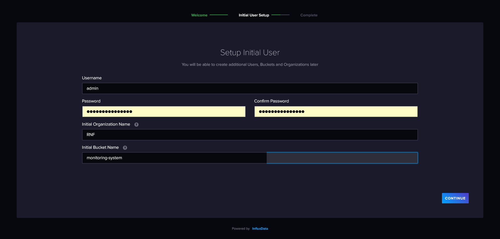

=====================================================
Gestion des données temporelles - InfluxDB et Grafana
=====================================================

..  youtube:: uCXxN-Cyat0

Certains capteurs peuvent produire des données avec un pas de temps très court (quelques secondes) qui peuvent vite représenter un gros volume, a exploiter avec les outils adéquats. 
Les bases de données relationnelles comme postgres ne sont pas conçues pour gérer ce type de données, et bien qu'il soit possible de bien définir des index pour amméliorer les performances, d'autres outils sont concues pour ça. 

Influx DB est un outil spécialement conçu pour gérer des séries temporelles. Il est facile à déployer sur un serveur et à utiliser, et peut se connecter à des outils comme Grafana

InfluxDB
========

Installation
------------

Installer cet outil se fait très simplement, en quelques commandes. Il faut dans un premier temps charger les archives d'influxdata :

.. code-block:: bash

    curl --silent --location -O https://repos.influxdata.com/influxdata-archive.key  

.. NOTE::

    Vous aurez peut être besoin d'installer curl avec un simple ``sudo apt-get install curl``

Puis vous devez mettre à jour les sources d'apt à partir de ces archives :

.. code-block:: bash

    echo "943666881a1b8d9b849b74caebf02d3465d6beb716510d86a39f6c8e8dac7515  influxdata-archive.key" | sha256sum --check - && cat influxdata-archive.key | gpg --dearmor | sudo tee /etc/apt/trusted.gpg.d/influxdata-archive.gpg > /dev/null && echo 'deb [signed-by=/etc/apt/trusted.gpg.d/influxdata-archive.gpg] https://repos.influxdata.com/debian stable main' | sudo tee /etc/apt/sources.list.d/influxdata.list

Et enfin lancer la mise à jour des sources et l'installation :

.. code-block:: bash

    sudo apt-get update && sudo apt-get install influxdb2

.. NOTE::

    Une version 3 d'InfluxDB semble presque prête, et il est possible dès aujourd'hui de demander un early access à la bêta via leur site internet

Il faut ensuite activer le service :

.. code-block:: bash

    sudo systemctl enable --now influxdb

Et voilà ! L'installation est terminée. Il ne reste plus qu'à se connecter sur son adresse IP au port 8086 pour afficher cette page :

\

On rentre alors les infos que l'on souhaite pour créer son instance. Un bucket est une base de données en gros. On pourra en créer d'autres après. Ca permet de cloisonner les données, surtout pour distinguer les politiques de rétention, notion importante d'influxDB si on ne veut pas saturer l'espace disque. 
Dans un premier temps, on créer un bucket monitoring-system :

\

On clique ensuite sur advanced configuration, car ce qui va nous intéresser pour mettre en place un monitoring system, c'est telegraf, qu'on va voir plus tard.

Importer des données
--------------------

Pour importer des données dans InfluxDB, il faut aller définir des sources de données. Il y a plein de manières de faire, et tout est clairement accompagné directement dans InfluxDB. On va parler ici plus précisément de 3 manières de faire : Importer un CSV, via un script python, et via telegraf. 

Via un csv
~~~~~~~~~~

Dans les sources de données on peut choisir ``Upload a CSV``. Il suffit de faire un glisser/déposer de son fichier pour lancer l'import. 

Mais attention, il faut un csv annoté, un csv classique ne fonctionnera pas. Parce qu'il n'y a pas de notions de tables dans InfluxDB, donc il faut que le CSV ait certaines information comme le _time, le _measurement ou le _value qui seront essentielles pour "ranger" les données. Il faut aussi définir si certaines régions sont des groupes (qui seront utilisés comme des tags) et le type de données. 

Voici un exemple de structure fourni dans la doc de influxdata :

.. code-block:: text

    #group,false,false,true,true,false,false,true,true,true,true
    #datatype,string,long,dateTime:RFC3339,dateTime:RFC3339,dateTime:RFC3339,double,string,string,string,string
    #default,mean,,,,,,,,,
    ,result,table,_start,_stop,_time,_value,_field,_measurement,host,region
    ,,0,2022-12-31T05:41:24Z,2023-01-31T05:41:24.001Z,2023-01-01T00:52:00Z,15.43,mem,m,A,east
    ,,1,2022-12-31T05:41:24Z,2023-01-31T05:41:24.001Z,2023-01-01T00:52:00Z,59.25,mem,m,B,east
    ,,2,2022-12-31T05:41:24Z,2023-01-31T05:41:24.001Z,2023-01-01T00:52:00Z,52.62,mem,m,C,east

Via un script
~~~~~~~~~~~~~

On peut aussi utiliser pas mal de langages pour importer des données. Pour le coup InfluxDB fourni pas mal d'aide directement dans l'outil d'import, dans la section "Client library". Voici un exemple pour python, ou il décrit étape par étape comment installer les dépendances, charger les données, écrire des données... :

\

On peut bien sûr utiliser ça dans une api flask, pour faire communiquer une app maison avec InfluxDB. 

Via telegraf
~~~~~~~~~~~~

Un autre moyen bien utile d'importer de la donnée, c'est d'utiliser telegraf, qui va permettre de faire du monitoring system, et que nous allons détailler un peu. 

Installation Telegraf
=====================

Le repo de telegraf est fourni par InfluxDB. On a donc déjà ajouté les sources. Plus qu'à télécharger et installer :

.. code-block:: bash

    sudo apt-get update && sudo apt-get install telegraf

Ensuite dans l'interface de InfluxDB, on va aller dans LoadData puis dans l'onglet Telegraf. On clique sur "Create configuration" pour rajouter un enregistrement de données. On choisit notre bucket dans lequel on va sauvegarder les données puis on a une multitude de sources possibles :

\

Ensuite, en fonction de ce qu'on choisi, on va pouvoir définir des paramètres. Par exemple si on fait un monitoring postgres, on va définir l'hote, login, password, databases... Ici je choisi de suivre la RAM (memory) et je n'ai pas de paramètre particulier à rentrer :

\

Vous devez enfin copier/coller les commandes proposées dans votre terminal pour enregistrer le token et lancer l'agent telegraf :

\

.. NOTE::

    En lançant "Listen for Data" j'ai toujours eu "Error Listening for Data" jsuqu'à présent... je ne sais pas pourquoi. Mais bon ça semble marcher quand même. 

Vous pouvez voir sur votre terminal, quand une tache telegraf est lancée, que le pas de temps est défini sur 10s. Vous aurez donc un enregistrement de votre variable sur ce pas de temps. 

Vous pouvez ensuite aller dans l'onglet d'exploration des données d'InfluxDB pour visualiser les données. Là vous devez définir les filtres qui vous permettent de selectionenr les données à afficher :

* le bucket que vous avez défini
* le _measurement qui correspond au type de données que vous avez cherché à sauvegarder, ici ça sera "mem"
* le _field, c'est l'intitulé du champs des données qui vont être sauvegardées, ici par exemple "used" pour la quantité de RAM utilisée

\

Et voilà ! vos données sont sauvegardées dans InfluxDB !

Définition d'un service
-----------------------

Pour s'assurer de la pérennité et du controle de l'enregistrement des données avec telegraf, il vaut mieux créer un service avec systemd. 

Vous pouvez créer un service générique, qui pourra s'appliquer sur plusieurs conf telegraf. 

Créez d'abord un fichier ``/etc/systemd/system/telegraf@.service`` avec le contenu suivant :

.. code-block:: bash

    [Unit]
    Description=Telegraf instance %i
    After=network.target

    [Service]
    Type=simple
    # On charge le fichier d'environnement spécifique à l'instance (s'il existe)
    EnvironmentFile=-/etc/telegraf/telegraf-%i.env
    ExecStart=/usr/bin/telegraf --config ${TELEGRAF_CONFIG}
    Restart=on-failure
    User=telegraf
    Group=telegraf

    [Install]
    WantedBy=multi-user.target

Ensuite on créer un fichier pour chaque instance dans le dossier ``/etc/telegraf/``. Pour notre suivi des RAM par exemple, on va faire un fichier ``/etc/telegraf/telegraf-ram.env`` avec le contenu suivant :

.. code-block:: bash

    INFLUX_TOKEN=SwxGwtcW31VrsJ5enwxPegP8AfxBqAIS4DlnpVoJo61RhM1qrAdSd75GOJLzL_q9hwrqraekQi1EzPqBm5PtLg==
    TELEGRAF_CONFIG=http://192.168.1.40:8086/api/v2/telegrafs/0ea0c237944f5000

Et on va créer un deuxième fichier pour le suivi de postgres par exemple ``/etc/telegraf/telegraf-postgres.env`` :

.. code-block:: bash

    INFLUX_TOKEN=tFh3Bhbt7cZhqWMqepPDte7YoMCd5ZWDSs14CtqpZ0vNwyZDW2LI6p77OAUGbuLsbKkHsCoIpgdAvq3B0PMUbQ==
    TELEGRAF_CONFIG=http://192.168.1.40:8086/api/v2/telegrafs/0ea0ca24e48f5000

On peut ensuite démarrer nos instances :

.. code-block:: bash 

    sudo systemctl start telegraf@ram
    sudo systemctl start telegraf@postgres

Pour vérifier leur état, vous pouvez utiliser :

.. code-block:: bash 

    sudo systemctl status telegraf@ram
    sudo systemctl status telegraf@postgres

Si vous souhaitez qu’elles démarrent automatiquement au démarrage du serveur, activez-les :

.. code-block:: bash 

    sudo systemctl enable telegraf@ram
    sudo systemctl enable telegraf@postgres

.. NOTE::

    Vos anciennes tâches continuent peut être encore de tourner, n'hésitez pas à faire ``pkill telegraf`` puis relancer vos services pour être sûr que les seules tâches telegraf qui tournent sont gérées par vos services. 

Grafana
=======

Installation
------------

Ajouter la clé GPG et le dépôt Grafana. Dans un terminal, exécutez :

.. code-block:: bash 

    # Installez les paquets requis
    sudo apt-get install -y software-properties-common apt-transport-https wget

    # Ajoutez la clé GPG officielle de Grafana
    wget -q -O - https://packages.grafana.com/gpg.key | sudo apt-key add -

    # Ajoutez le dépôt Grafana à vos sources
    echo "deb https://packages.grafana.com/oss/deb stable main" | sudo tee /etc/apt/sources.list.d/grafana.list

Mettre à jour les paquets et installer Grafana :

.. code-block:: bash 

    sudo apt-get update
    sudo apt-get install grafana

Démarrer et activer Grafana :

.. code-block:: bash 

    sudo systemctl start grafana-server
    sudo systemctl enable grafana-server

Par défaut, Grafana est accessible via votre navigateur à l'adresse http://localhost:3000 ou via l'IP du serveur si vous l'installez sur un serveur distant.

Les identifiants par défaut sont :

* Utilisateur : admin
* Mot de passe : admin

Il vous demandera de les mettre à jour immédiatement. 

Paramétrer un dashboard
-----------------------

Pour paramétrer un dashboard, vous devez dans un premier temps définir vos sources de données, en allant dans l'onglet ``connections/data sources`` et en cliquant sur ``Add new data source``.

Là vous devez remplir le formulaire suivant. Utilisez le query language "Flux", c'est celui conseillé pour InfluxDB2. Et vous devez juste reporter votre url, votre organization, votre token et votre default bucket :

\

Une fois le data source défini, vous pouvez aller créer un dashboard, dans l'onglet du même nom, et y ajouter une visualization. Vous choisissez votre source de données, et vous devez rentrer une requête flux pour charger de la données. 

Voici une requête pour les données de RAM utilisée des dernières 24h :

.. code-block:: bash 

    from(bucket: "monitoring-system")
        |> range(start: -24h)
        |> filter(fn: (r) => r._measurement == "mem" and r._field == "used")

Vous pouvez changer tout un tas de paramètres dans le panel de droite, ici je n'ai changé que le titre :

\

Vous pouvez ensuite ajouter autant de visualisations d'autant de sources de données que vous souhaitez, et modifier la place et la taille des différents items pour construire votre dashboard. 

Vous pouvez partager le dashboard en cliquant sur share, et l'intégrer dans une app avec un iframe par exemple. Vous pouvez également définir des variables, notamment via l'url, qui vous permettront dans une app perso de charger les données précises, sur des sites spécifiques par exemple, avec les tags appropriés. 
