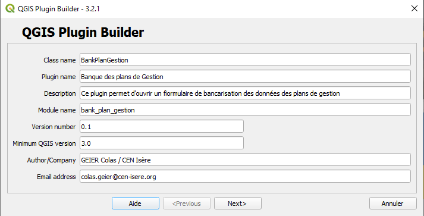

Développer un plugin Qgis
=========================

Installer ``Plugin Builder 3`` |logo_pluginBuilder|
---------------------------------------------------
1. allez dans "Extensions"
2. puis "Installer/Gérer les extensions"
3. Installer l'extension ``Plugin Builder 3``

Créer sa première extension (`source doc <https://docs.qgis.org/3.28/fr/docs/pyqgis_developer_cookbook/plugins/plugins.html#getting-started>`_)
-----------------------------------------------------------------------------------------------------------------------------------------------

Définition du plugin
~~~~~~~~~~~~~~~~~~~~

Ouvrir l'extension ``Plugin Builder 3`` |logo_pluginBuilder|, et compéter les différentes étapes du formulaire.

.. |logo_pluginBuilder| image:: /_static/qgis_builder/logo_pluginBuilder.png
   :height: 30
   :width: 30

1. Pré-définir les métadonnées et le squelette de votre plugin.

.. NOTE::

    Les métadonnées sont customisables, une fois votre plugin défini. Pour cela, éditer et customiser le fichier ``metadata.txt`` citué à la racine du dossier du plugin nouvellement créé.
    
    Toutes les métadonnées contenues dans ce fichier doivent être encodées en UTF-8.

    La liste des éléments s'observe `là <https://docs.qgis.org/3.28/fr/docs/pyqgis_developer_cookbook/plugins/plugins.html#writing-plugin-code>`_.  

``Class name``    Nom de la class Python qui figurera dans le fichier `MonPlugin.py`. Cette class est importée dans le fichier __ini__.py de votre plugin.

``Plugin name``   Titre de votre plugin qui sera lu par les utilisateurs.

``Description``   Description de votre plugin. Texte court qui décrit le plugin, pas d” HTML autorisé.

``Module name``   Nom que prendra votre fichier `monPlugin.py`.

``Version number``    Numéro de version de votre plugin.

``Minimum QGIS version``  Version minimal requise par Qgis pour que votre plugin fonctionne. 

``Author/Compagny``   Nom du dévelopeur (le votre) ou celui de votre structure. Ou les deux !

``Email adress``  Adresse email de la personne chargée de maintenir le bon fonctionnement du module.

2. A propos de votre plugin

Texte plus long qui décrit le plugin en détail, pas de HTML autorisé.
Vous pouvez noter ici tout ce que vous désirez décrire à propos de votre plugin, cette zone de texte sera lu par les utilisateurs.

3. Choix du modèle

Sélectionné le type de modèle désiré : 
* Tool button with dialog   (Modèle choisi pour la présentation)
* Tool button with dock widget
* Processing Provider

``Text for the menu item``  Text bref apparaissant au survol de l'icon du plugin, lorsque ce dernier est installé dans les Extensions QGIS.

4. Choix des différents éléments à générer.

Par défaut, tout est sélectionné, c'est pas gênant. 

Si vous ne savez pas trop quoi faire à cette étape, laissez les choses comme telles et passez à l'étape suivante.

5. Définition des redirections.

``Bug tracker`` Lien vers la page des tickets de votre plugin (exemple : https://unePlateformeGit.ex/monCompte/monPlugin/Issues)

``Repository``  Lien vers le dépot officiel de votre plugin (exemple : https://unePlateformeGit.ex/monCompte/monPlugin)

``Home page``   Lien vers la documention officiel de votre plugin (exemple : https://si-en-reseau.reserves-naturelles.org/tutos/qgis_builder.html)

``Tags``    Liste des étiquettes de votre plugin, permettant son référencement dans la listes des extensions disponible à votre QGIS.

6. Select Output Directory
   
Enregistrer votre nouveau plugin dans le dossier de votre choix.

Création de l'interface graphique
~~~~~~~~~~~~~~~~~~~~~~~~~~~~~~~~~

Suite à la génération de votre plugin, vous pouvez maintenant customiser son interface utilisateur. Si votre plugin n'est pas encore généré, reportez-vous à `Définition du plugin`_

1. Ouvrir le fichier ``.ui`` de votre plugin à l'aide de l'application ``QT Designer`` (application faisant partie de la suite QGIS).

.. video:: ./_static/qgis_builder/capture_openQT.webm
   :height: 323
   :width: 648

2. Créer votre formulaire de toutes pièces 

Insérer les éléments de votre choix, à partir de la ``boite de widget``, pour constituer votre interface utilisateur. Chaque élément doit posséder un nom d'objet unique. Pensez à les renomer après chaque ajout de sorte à pouvoir les identifier par la suite.  

