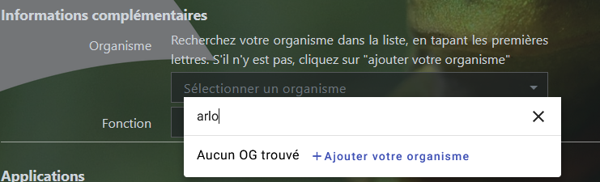
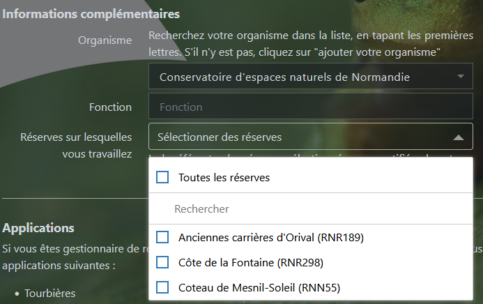
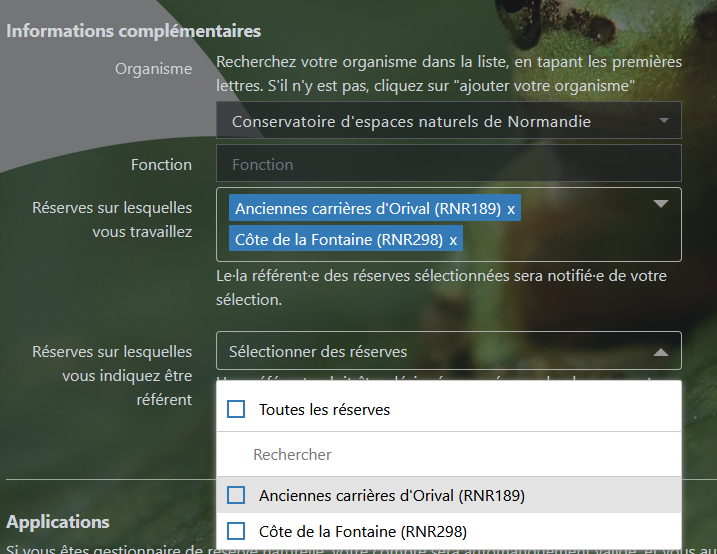
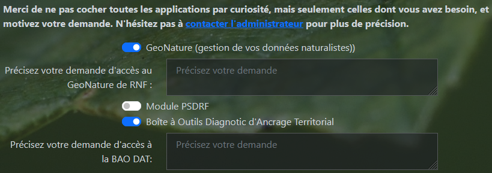
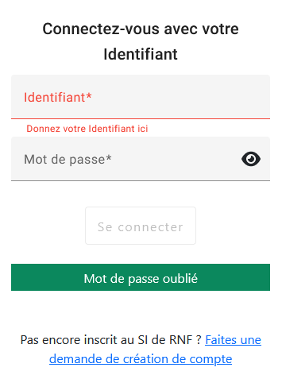
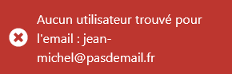
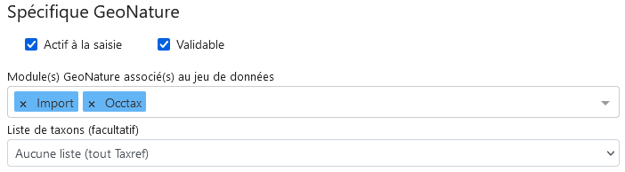
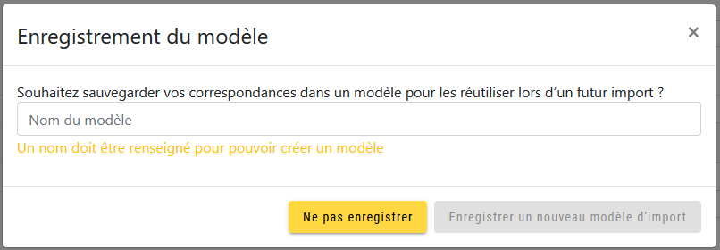
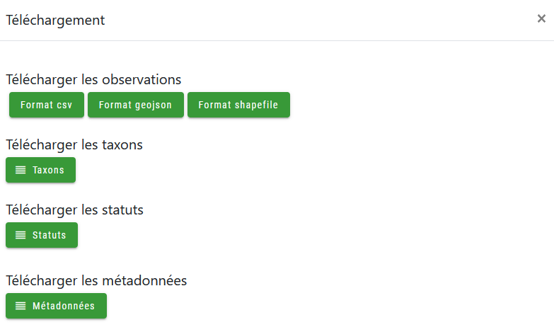

======================================================================================================
Système d'Informations de Réserves Naturelles de France et son GeoNature (Atelier du 30 novembre 2023)
======================================================================================================

..  youtube:: 2rRe7gHJjYQ

\

Le système d'informations de Réserves Naturelles de France regroupe un ensemble d'applications mises à dispositions des membres et des partenaires de l'association. 
Les diverses applications sont présentées sur la page https://plateformes.reserves-naturelles.org/ 
L'ensemble des applications développées par RNF utilisent un système d'authentification unique vous permettant d'avoir le même login et mot de passe pour toutes ces applications.
Tout gestionnaire de réserve naturelle ou partenaire de RNF peut s'inscrire et demander des accès à ces applications. 

Certaines applications nécessitent simplement d'avoir un compte, comme l'annuaire des tourbières du réseau ou le nouveau site internet de RNF. 
D'autres vont nécessiter une validation d'accès (BAO Ancrage, GeoNature, PSDRF...). Précisez bien votre demande pour faciliter la modération. 

L'inscription
=============

La première étape est donc de faire une demande d'inscription, via le formulaire disponible ici : https://plateformes.reserves-naturelles.org/inscription 

Remplissez bien les informations demandées. 

Si vous êtes gestionnaire de réserve, votre organisme est normalement dans la liste (si ce n'est pas le cas, contactez moi). Attention à bien faire votre recherche, par exemple un CEN peut être indiqué avec l'acronyme ou en toutes lettres conservatoire d'espaces naturels. 
La recherche n'est pas sensible à la casse, c'est à dire que les majuscules/minuscules ne changeront rien, en revanche les accents sont importants. Ainsi "rhone" ne donnera aucun résultat, alors que "rhône" renverra au moins 7 organismes.

Si votre organisme n'est pas dans la liste, la mention "Aucun OG trouvé" s'affiche à la recherche, et vous pouvez cliquer sur "Ajouter votre organisme". 

\

La liste déroulante disparait donc et est remplacée par un champs texte, vous pouvez taper en toute lettre le nom de votre organisme. 

Si votre organisme était bien dans la liste et est gestionnaire de réserve, une nouvelle liste déroulante apparait avec l'ensemble des réserves dont l'OG est gestionnaire ou co-gestionnaire. Sélectionnez la ou les réserves qui vous concernent directement. Il est possible de n'en sélectionner aucune si vous travaillez pour un OG mais pas sur une réserve. 

\

Dès lors qu'au moins une réserve est sélectionnée, une troisième liste déroulante apparait contenant uniquement les réserves sélectionnées. Cochez la ou les réserves pour lesquelles vous êtes le référent, c'est à dire typîquement des postes de conservateur·trice ou de directeur·trice de réserve. Il peut y avoir plusieurs référents pour une même réserve, selon vos choix. 

\

Le rôle de référent sert principalement à controler les profils liés aux réserves. Lorsqu'un nouvel utilisateur s'incrit et se lie à une réserve, un mail sera envoyé aux référents de la réserve pour les prévenir de cette ajout. A eux de revenir vers l'administrateur si jamais ce profil ne doit pas être lié à la réserve en question. 

Si la liaison avec une réserve sera automatique, le statut de référent sera lui modéré par l'équipe RNF. 

Cochez ensuite les applications auxquelles vous demandez un accès, et expliquez votre demande pour chacune d'entre elles :

\

Pour chaque application, un mail sera envoyé au référent de l'équipe RNF, qui validera ou non votre accès à cette application. 

.. WARNING:: 

    Attention, ne cochez pas toutes les applications par curiosité. Si vous cochez une des applications, c'est que vous savez à quoi elle sert et que vous en avez besoin. Sinon, contactez l'administrateur pour plus d'informations. 

Dès lors que votre inscription sera validée, vous recevrez un mail de confirmation. Cela veut dire que votre compte sera actif. Mais il peut y avoir ensuite un délai pour la validation de l'accès aux applications spéficifques. 

.. NOTE::

    Vous pourrez bientôt voir dans votre page "Mes informations", les applications auxquelles vous avez accès et le statut de vos demandes en cours. 

Mot de passe oublié
===================

Vous avez oublié votre login ou votre mot de passe ? Pas de panique !

Allez sur la page https://plateformes.reserves-naturelles.org/ et cliquez sur le logo pour vous connecter en haut à droite |logo_connection|.

    .. |logo_connection| image:: /_static/si_rnf/logo_connection.png
        :height: 30
        :width: 30

\

Cliquez sur "Mot de passe oublié". Tapez votre adresse mail associée à votre compte, puis cliquez sur "Envoyer". 

Vous recevrez rapidement un mail avec votre identifiant et un lien pour réinitialiser votre mot de passe. 

Si l'adresse mail tapée renvoit un message comme ci dessous indiquant qu'aucun utilisateur n'est trouvé pour cet adresse, c'est que vous n'avez pas de compte. Créez-en un !

\

Editer ses informations personnelles
====================================

Il peut être intéressant de modifier ses informations personnelles, comme sa fonction, son mail, les réserves associées...

.. NOTE::

    Cette opération n'est pas possible aujourd'hui mais le sera très prochainement depuis la page https://plateformes.reserves-naturelles.org/, onglet "Mes informations" ! 

Le GeoNature de RNF
===================

Utiliser l'instance GeoNature de RNF est possible pour tout gestionnaire de réserve naturelle. S'il est également gestionnaire d'autres espaces protégés, il peut naturellement gérer l'ensemble de ses données naturalistes sur notre instance. 

Une condition est cependant essentielle pour l'instant : **être en France métropolitaine**. Malheuresement, le système de projection des données de notre GeoNature est le Lambert93. Je réfléchis cependant à déployer une instance pour les outre mer, si la demande existe. N'hésitez pas à me contacter si c'est le cas. 

.. WARNING:: 

    Attention, RNF met à disposition une instance GeoNature pour permettre aux organismes gestionnaires sans compétences techniques ou moyens financiers de disposer d'un outil de gestions de leurs données naturalistes. 
    Néanmoins, cet outil ne sera pas adaptables aux besoins spécifiques de chacun et compporte évidemment quelques limitations du fait d'un usage partagé par plusieurs organismes. 

    Si vous en avez la possibilité, il reste donc préférable que vous déployez votre propre instance GeoNature.

La première étape est donc, à l'inscription, de cocher GeoNature dans la liste des applications. 

Dès votre accès validé, vous pourrez vous connecter à l'adresse suivante : https://geonature-saisie.reserves-naturelles.org/

Le GeoNature est partagé entre tous, mais vous ne verrez que les données de votre organisme gestionnaire. Si votre OG dispose de plusieurs réserves, alors vous verrez les données de toutes ces réserves. Par défaut, vous ne pourrez éditer que vos propres données. Si besoin, vous pouvez avoir un role de "référent géonature" pour votre OG, et donc pour éditer et supprimer l'ensemble des données de votre OG (contactez l'administrateur).

Les métadonnées
---------------

La première étape consiste à aller créer des cadres d'acquisition et des jeux de données, et de renseigner toutes les informations associées. Vous pourrez le faire dans l'onglet |metadonnees|.

    .. |metadonnees| image:: /_static/si_rnf/metadonnees.png
        :height: 30

.. NOTE::

    Les définitions des cadres d'acquisition et des jeux de données selon le standard "métadonnées" du SINP sont les suivantes : 

    **Cadre d'acquisition (CA) :** Ensemble des moyens mis en œuvre pour l’acquisition de données dans le cadre d’un projet défini par un ou plusieurs maîtres d’ouvrage. 
    La conception est réalisée par un ou plusieurs maîtres d’œuvre qui coordonne son application et en assure le suivi. 
    Il est organisé afin de pouvoir répondre aux objectifs du projet. Un cadre
    d'acquisition peut faire appel à plusieurs protocoles d’acquisition, plusieurs méthodes de collecte, plusieurs producteurs
    de données et plusieurs sources de financement différentes affectées au dispositif ou à des parties de ce dernier. Chaque
    cadre d'acquisition crée un lot de données. Ce lot de données peut être structuré en un ou plusieurs jeux de données
    localisés dans une ou plusieurs bases de données. Cette structuration est définie par un maître d’œuvre en fonction des
    objectifs du projet.

    **Jeu de données (JDD) :** Un jeu de données est une compilation de données. La compilation consiste au regroupement
    de données du cadre d'acquisition dans un contexte de structuration des données définie par le maître d’œuvre en
    fonction des objectifs du projet. Cette compilation est réalisée par le producteur de données. Tout jeu de données doit être
    rattaché à un cadre d'acquisition.

Vous êtes bien sûr libres de gérer vos données comme vous le souhaitez, mais vous devez à minima avoir un cadre d'acquisition qui comprend un ou plusieurs jeux de données. 
Beaucoup de réserves n'ont qu'un cadre d'acquisition (nommé "Données de la réserve blabla") qui comprend plusieurs jeux de données ("Données opportunistes", "Protocole X", "Suivi de l'espèce N" ...).

Dans un premier temps créez donc votre 1er cadre d'acquisition, et remplissez toutes les informations demandées. Les éléments précédé de rouge sont obligatoire et le bouton "Enregistrer le cadre d'acquisition" restera grisé et non cliquable tant que tous n'auront pas été remplis. 
Pensez-bien à définir à minima un contact principal sur la colonne de droite, soit un organisme, soit un individu, soit les deux. 

Vous pouvez ensuite créer un jeu de données selon le même principe. Vous devrez alors sélectionner un cadre d'acquisition dont il dépend. 

Certains paramètres spécifiques à GeoNature doivent être spécifiés en fin de formulaire et sont importants :

\

"Actif à la saisie" est assez explicite. "Validable" permettra d'utiliser le module de validation (pas actif pour le moment - voir :ref:`validation`). 

La liste des modules est très importante, sélectionnez bien les modules avec lesquels vous voulez utiliser le JDD sinon ça ne marchera pas. Sélectionnez "Import" pour pouvoir y importer des données depuis un csv, "Occtax" pour y faire de la saisie d'occurences de taxons...

Le choix de la liste de taxons est, comme indiqué, facultatif. Par défaut tout taxon pourray être saisi. Si vous souhaitez limiter un JDD à une liste de taxons spécifique, vous devez d'abord transmettre une liste de taxons, comportant impérativement les cd_nom de taxref, à l'administrateur.

Occtax
------

C'est le module principal de GeoNature ou vous pouvez retrouver vos données d'observations de taxons et en ajouter. 

Pour ajouter un nouveau taxon, cliquez sur "Ajouter un relevé".

Vous devez commencer par définir l'emprise géographique de votre relevé. Pour cela, vous disposez de plusieurs outils :

* |point| C'est l'outil de base, qui permet de pointer sur la carte le lieux de l'occurence.
* |ligne| Cet outil permet de tracer une polyligne composé de plusieurs segments. Il suffit de recliquer sur le dernier point pour terminer la saisie. 
* |polygone| Cet outil permet de tracer un polygone. Il suffit de recliquer sur le premier point pour terminer la saisie. 
* |edit| Cet outil permet d'éditer une polyligne ou un polygone déjà tracé. En effet, si vous recliquez sur les outils précédents, vous devrez recommencer votre tracé à zéro. 
* |files| Cet outil permet de charger un fichier contenant l'objet géographique souhaité, sous le format GPX, KML ou GeoJSON.
* |gps| Cet outil permet de définir un point d'occurence à partir de coordonnées GPS en degrés décimaux sur le référentiel WGS84. 
* |save| Cet outil permet d'enregistrer le tracé existant dans une liste de lieux, pour les réutiliser lors de saisies ultérieures. 
* |lieux| Cet outil permet de retrouver ses lieux enregistrer, pour les réutiliser. 

    .. |point| image:: /_static/si_rnf/pictos/point.png
            :height: 30
    .. |ligne| image:: /_static/si_rnf/pictos/ligne.png
            :height: 30
    .. |polygone| image:: /_static/si_rnf/pictos/polygone.png
            :height: 30
    .. |edit| image:: /_static/si_rnf/pictos/edit.png
            :height: 30
    .. |files| image:: /_static/si_rnf/pictos/files.png
            :height: 30
    .. |gps| image:: /_static/si_rnf/pictos/gps.png
            :height: 30
    .. |save| image:: /_static/si_rnf/pictos/save.png
            :height: 30
    .. |lieux| image:: /_static/si_rnf/pictos/lieux.png
            :height: 30

Une fois l'emprise géographique saisie, remplissez les informations sur le formulaire de droite. Pour les observateurs, ils doivent déjà exister en temps qu'utilisateur sur GeoNature. 
Il est possible d'ajouter des observateurs sans pour autant qu'ils aient un compte actif, voir :ref:`ajouter_observateurs`. Les altitudes sont calculées automatiquement à partir du modèle numérique de terrain de l'IGN. Si vous avez des informations plus fines vous pouvez les modifier. L'habitat peut être défini (selon référentiel EUNIS).

Une fois les informations de relevé saisies, cliquez sur "Enregistrer et saisir des taxons". 
Vous pouvez alors ajouter un taxon, et plusieurs dénombrements associés.

Remplissez l'ensemble des informations demandées. Seul le taxon est exigé de base (recherché dans le référentiel taxref). Par défaut, les paramètres sont les suivants :

* Technique d'observation : Vu
* Etat biologique : Observé vivant
* Déterminateur : Observateur courant
* Statut d'observation : Présent
* Naturalité : Sauvage
* Nombre : 1

Les autres informations sont indiquées comme "Non renseigné" ou "inconnu". Vous pouvez bien sûr les modifier. Cliquez sur "Avancé" pour afficher tous les choix. 

.. NOTE::

    Un terme ne vous parrait pas clair ? 

    Posez la souris dessus, la définition s'affiche. Les nomenclatures proviennent du standard occtax. 

Vous pouvez également ajouter des médias si besoin. Par défaut il attend une photo, mais en cliquant sur "avancé" vous pouvez définir un autre type de média et/ou une url plutôt qu'un fichier. 

Pour ajouter d'autres dénombrements, cliquez sur le petit plus |plus| à droite du formulaire dénombrement pour en ajouter un. 

    .. |plus| image:: /_static/si_rnf/pictos/plus.png
            :height: 30

Cliquer sur "Enregistrer ce taxon" une fois terminé pour celui-ci. Vous pouvez alors en saisir un nouveau. Une fois tous les taxons souhaités saisis, vous pouvez cliquer sur "Terminer la saisie". 

.. NOTE:: 

    Vous saisissez plusieurs relevés d'un coup ? 
    
    Pour ne pas perdre de temps, pensez à cocher le bouton |recursif| "Enchainer les relevés" en haut à droite de l'écran. Comme ça dès qu'un relevé sera saisi, vous reviendrez automatiquement au formulaire vide pour saisir un nouveau relevé, plutôt que de revenir à la liste des relevés.

    .. |recursif| image:: /_static/si_rnf/pictos/recursif.png
            :height: 30

Import
------

Ce module, comme son nom l'indique, permet d'importer des données dans GeoNature depuis un fichier csv ou geojson. 

.. WARNING:: 

    Le module import est le seul moyen pour les utilisateurs du GeoNature de RNF d'importer leurs données historiques. 
    
    A ce jour, les données importées via ce module sont directement versées dans le module synthèse, et **ne sont donc pas modifiables ensuite**. 

    Une évolution du module import est prévue dans les mois qui viennent et devrait permettre d'importer des données dans le module de son choix (occtax par exemple).

Laissez-vous guider par le processu d'import de données, qui est très explicite et accompagne l'utilisateur pas à pas. Pour commencer cliquer sur le petit plus |plus| pour ajouter un import. 

Chaque import de données vise un jeu de données spécifique. Segmentez bien vos données historique avant l'import pour les répartir dans les jeux de données correspondants. 

Quelques informations sont indispensables dans votre jeu de données à importer : 

* une date
* un/des observateur/s
* une information géographiques (coordonnées x/y, géométrie WKT, identifiant INSEE d'une commune, code maille MNHN ou code insee département) 
* le nom cité du taxon
* le cd_nom de taxref du taxon

Une fois le fichier versé et les caractéristiques définies (la plupart des paramètres sont auto-détectés), vous devez faire un appariement des champs, c'est à dire indiquer à quel champs de géonature correspond chaque champ de votre fichier. 

Attention à plusieurs choses : 

* Si vos données ont déjà été transmises au SINP, il est utile de récupérer les UUID (identifiants uniques) qui permettront d'éviter les doublons. S'il ce n'est pas le cas et que vous n'avez pas d'UUID défini, cochez "Générer les identifiants SINP manquants".
* Si vous n'avez pas de données d'altitude définies, vous pouvez les générer automatiquement à partir du modèle numérique de terrain de l'IGN intégré à GeoNature, cochez "Générer les altitudes manquantes".
* Si vous avez une série d'informations qui n'ont pas de correspondance dans le standard occtax, ajoutez les au champ "champs additionnels" (autant que vous voulez). Vous ne pourrez pas utiliser ces données comme filtre dans GeoNature, mais elles seront exportables au format json dans une colonne. 

Si votre source de données est souvent la même, vous pouvez enregistrer votre modèle d'import pour gagner du temps. Cela vous est proposé en cliquant sur "Suivant". Vous pouvez à l'inverse charger un modèle d'import, en tout début de formulaire, en le choisissant dans la liste déroulante. 

\

.. NOTE::

    Les modèles d'import peuvent être publics, c'est à dire disponibles pour tous les utilisateurs. 

    Un modèle d'import spécifique à SERENA sera mis à disposition prochainement pour faciliter l'import des données depuis SERENA. 

L'étape suivante est assez similaire, et consiste à faire un appariemment des nomenclatures. Chaque élément textuel de votre fichier va devoir être associé à une nomenclature officielle de OccTax. 

De la même manière que pour l'appariement des champs, il est possible d'enregistrer un modèle d'import des nomenclatures. 

Vous devez ensuite "Lancer la vérification des données". 

.. NOTE:: 

    Pour une raison inconnue, le processus de vérification indique parfois "fichier incorrect". Revenez à l'étape précédante en cliquant sur l'étape 4 en haut de l'écran. Puis recommencez. 

La validité de vos donnée sera donc controlée, et vous aurez une dernière vérification avant import de vos données. Vous pourrez y générer un rapport d'erreur pour voir quelles données n'ont pu être validées et pourquoi. 
Vous verrez également l'étendue géographique de vos données. Vous pourrez prévisualiser l'ensemble des données valides. 

Enfin, cliquez sur "Importer vos n observations valides" pour terminer le pocessus d'import. 

Même si toutes vos données ne sont pas valides, vous pouvez terminer l'import. Vous pourrez ensuite exporter les données non valides, pour effectuer les correction nécessaires, et recommencer le processus avec ces données. 

.. WARNING::

    Les données importées, comme dit au début, ne sont pas éditable une par une. Cependant, il existe un moyen de corriger des erreurs d'import... c'est de le recommencer. Dans la liste des imports, cliquer sur "Modifier un import", revenez à la première étape et chargé votre fichier corrigé. Refaites l'ensemble du processus. Attention donc à bien avoir dans votre fichier l'ensemble des données qui avaient été importées. 

Synthèse
--------

Vous retrouverez dans le module synthèse l'ensemble des données qui proviennent des différents modules de GeoNature ainsi que du module d'import. 

Vous pouvez faire une recherche assez fine avec les critères que vous souhaitez. Vous pouvez déssiner une emprise géographique ou importer un gpx, kml ou geojson. 

Une fois la sélection faite, vous pouvez télécharger différentes données sous différents formats : 

\

Saisie terrain
--------------

Avec GeoNature, vous pouvez également faire de la saisie terrain. Cela se limite aujourd'hui aux données d'occurences de taxons, donc liées au module Occtax. 

Pour cela, rien de plus simple ! Télécharger l'appli directement depuis votre mobile à partir du lien suivant : https://github.com/PnX-SI/gn_mobile_occtax/releases/download/2.6.1/occtax-2.6.1-generic-release.apk 

Renseigné l'adresse du GeoNature de RNF : https://geonature-saisie.reserves-naturelles.org/ puis vos identifiant et mot de passe. 

Vous pouvez ensuite saisir directement vos données sur le terrain. 

.. NOTE::

    Actuellement, l'ensemble des 600000 taxons de TaxRef ainsi que tous les observateurs du GeoNature de RNF sont chargés sur votre mobile, ce qui d'une part long à télécharger, mais en plus peut ralentir votre mobile.

    Une nouvelle version de l'appli va bientôt être déployée, permettant de définir une liste de taxons et une liste d'observateurs spécifiques. Vous devrez pour cela fournir à l'administateur une liste des cd_nom de taxref des taxons que vous souhaitez dans votre liste. 

Vous avez, dans l'application, un fond de carte en ligne qui est OpenStreetMap. Si vous n'avez pas de réseau sur votre terrain, vous aurez sans doute besoin de fond "offline".

Pour cela, il vous faut mettre dans votre mobile des fichier .mbtiles. Ces fichiers peuvent être générés avec QGIS, et en particulier avec la fonction "Générer des tuiles XYZ". A vous de jouer avec les paramètres pour générer un fichier qui ne soit pas trop lourd pour être performant tout en ayant une définition assez fine pour vos besoins. 

3 fichiers peuvent être attendus par l'applications :

* un fichier nommé ign.mbtiles sur lequel vous pouvez mettre un fond carto IGN 
* un fichier nommé ortho.mbtiles sur lequel vous pouvez mettre une prise de vue aérienne que vous souhaitez (ortho IGN à 20cm par exemple)
* un fichier nommé osm.mbtiles sur lequel vous pouvez mettre un fond OSM, comme celui en ligne, mais qui sera accessible hors ligne

Mettez ces fichiers où vous voulez sur votre téléphone. Plus il sont près du dossier racine (c'est à dire le dossier d'ouverture de votre téléphone), plus ils seront rapidement trouvés par l'application.

.. NOTE::

    Si vous n'êtes vraiment pas en mesure de produire vos propres fonds de carte, contacter l'administateur.

Occhab
------

Dans ce module vous pouvez ajouter des stations, et y associer un ou plusieurs habitats. Son fonctionnement est asses simple et similaire à occtax. 

Monitorings
-----------

Le module Monirotings permet de créer des sous-modules de saisie de données protocolées. Si sur occtax il n'est pas possible d'ajouter des informations hors standard d'occurence de taxons, on peut ici générer des formulaires avec les informations que l'on veut sur 4 niveaux :

* groupes de sites
* sites
* visites
* observations

Dès lors qu'un protocole est commun à plusieurs réserves, RNF développera un sous-module dédié au protocole (s'il n'existe pas déjà ou si d'autres outils ne sont pas déjà en place).

Une liste de sous-modules déjà développés existe et est accessible ici : https://github.com/PnX-SI/protocoles_suivi/ Si l'un de ces modules vous intéresse, contactez l'administrateur. 

Il ne sera cependant pas possible de produire des sous-module spécifiques aux gestionnaire à la demande. 

.. NOTE::

    Actuellement la gestion des droits utilisateurs du module monitorings n'est pas prise en compte. Aussi, dès lors qu'un utilisateur à accès à un sous-module, il peut modifier ou supprimer l'ensemble des données de tous les utilisateurs. Il faut alors duppliquer le sous-module autant de fois que d'organismes pour palier au problème. 
    
    Une nouvelle version doit sortir très prochainement, qui inègrera la gestion de ces droits. Nous attendons donc cette version pour le mettre à disposition des utilisateurs. 

.. _validation:

Validation
----------

Un module dédié à la validation existe, et il sera mis en place prochainement. Un statut de validateur peut être donné à certains utilisateurs.

Export
------

Un module d'export, permettant d'enregistrer des formats spécifiques d'export, et d'exporter de gros jeux de données existe. Il sera déployé prochainement. 

.. _ajouter_observateurs:

Ajouter des observateurs sans compte
------------------------------------
Certains observateurs n'ont pas besoin de compte, parce qu'ils ne saisissent pas directement la données (prestataires par exemple). Il est possible de quand même ajouter ces utilisateurs à GeoNature pour qu'ils soient dans la liste des observateurs. 

Actuellement, il est nécessaire d'envoyer une liste des observateurs sans compte à l'administateur pour un ajout par ses soins, avec les éléments suivants :

* nom
* prénom
* fonction
* adresse mail (au cas où la personne crée finalement un compte un jour, qu'elle soit associée à ses données)

.. NOTE::

    La création d'un formulaire spécifique d'ajout d'observateurs sans compte est prévue, et sera bientôt disponible pour les référents GeoNature des OG. 

Question fréquentes
-------------------

* *Quelle est la version de taxref ?*

La version actuelle de taxref du GeoNature de RNF est la 14 (de 2020). Elle sera néanmoins prochainement mis à jour vers la 16 voir la 17 qui devrait bientôt sortir. 

* *Il manque des items dans les nomenclatures, c'est normal ?*

Les nomenclatures sont issues du projet GeoNature et définies dans le standard occtax pour la grande majoritée. Il n'est pas prévu de les modifier ou d'ajouter des items. Si vous constatez néanmoins des erreurs ou des manques par rapport au standard, contactez l'administrateur.

* *Comment puis-je ajouter des données par site récurent ?*

Pour ajouter des données sur un site (polygone) sur lequel vous revenez souvent, vous pouvez l'ajouter dans les lieux d'occtax et le rechercher dans la liste déroulante à chaque fois. 
Cela enregistre simplement la géométrie et l'associe à la donnée.
Un module monitorings générique sera toutefois créé sous peu, vous permettant d'avoir une liste de sites et de saisir vos visites et vos observations dessus. Les données seront alors bien cloisonnées par site.

* *Mes données sont-elles transmises automatiquement au SINP ?*

Non. Il n'existe pas de lien entre le GeoNature de RNF et votre SINP régional. A vous d'exporter vos données et de les transmettre à votre SINP. 

