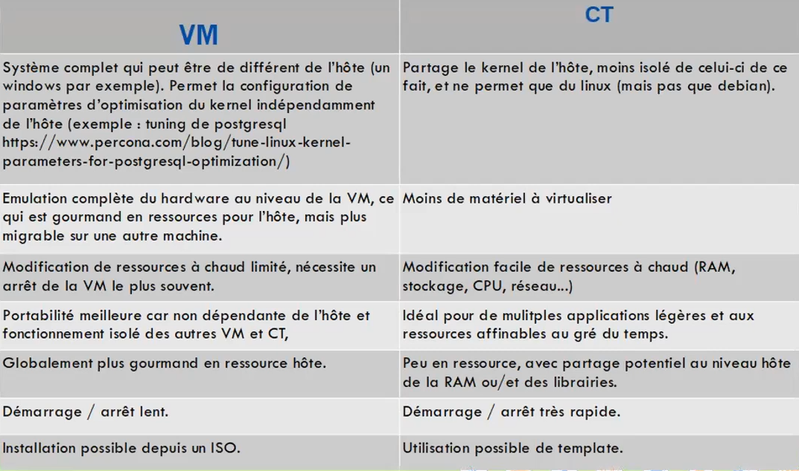

==================================================
Sécuriser un serveur d'applications Proxmox (Atelier du 25 mars 2026)
==================================================

.. contents:: Table des matières
   :local:
   :depth: 2

Introduction
============

Ce tutoriel explique comment sécuriser un serveur d'applications Proxmox.

Un court résumé du tutoriel de Ludovic
=======================================

Voir aussi : :doc:`proxmox`:

Ludovic a présenté son tutoriel sur la virtualisation avec Proxmox, ce qu'il faut retenir pour ce tuto est :

Conteneurs vs VMs
-----------------

Dans Proxmox, vous avez le choix entre deux technologies et ce choix impacte directement la stratégie de sécurité.

1. Les Machines Virtuelles (VM / KVM)

    Une VM simule un matériel complet. Elle possède son propre Kernel (noyau) indépendant de celui de l'hôte Proxmox.

    Isolation : Maximale. Si le noyau de la VM est compromis, l'attaquant est toujours enfermé dans une "boîte" matérielle virtuelle.

    Sécurité : Idéal pour les bases de données, les serveurs de monitoring, Firewalls, etc.

    Inconvénient : Plus gourmand en ressources (émulation complète).

2. Les Conteneurs (LXC)

    Les conteneurs partagent le Kernel de l'hôte Proxmox. Ils sont beaucoup plus légers car ils ne simulent pas de matériel.

    Isolation : Moindre. Une faille de sécurité permettant une "évasion de conteneur" (container escape) peut potentiellement donner un accès direct au noyau du serveur Proxmox lui-même.

    Sécurité : Bien garder unprivileged pour les conteneurs pour éviter les attaques. Cela empêche un utilisateur root à l'intérieur du conteneur d'avoir les droits root sur l'hôte physique.

    Avantage : Performance quasi native et démarrage instantané.

Le magnifique tableau comparatif de Ludovic :

Sécuriser l'hôte physique (Proxmox)
===================================

Par défaut, un serveur dédié Cloud (comme chez OVH par exemple) expose directement son adresse IP publique. Proxmox écoute sur toutes ses interfaces, notamment le port ``8006`` (Interface Web) et ``22`` (SSH). C'est le talon d'Achille de l'infrastructure : les bots du monde entier scannent ces ports 24h/24 pour tenter des attaques par force brute.

**La règle d'or : Ne jamais exposer l'interface d'administration de l'hyperviseur sur Internet.**

Deux stratégies principales s'offrent à nous :

La Whitelist SSH et le Tunnel Sécurisé (Le choix puriste)
---------------------------------------------------------

L'idée est simple : on ferme publiquement toutes les portes d'administration de l'hyperviseur (le port Web 8006 n'est plus accessible sur Internet). La seule porte d'entrée restante est le port SSH, et elle ne s'ouvre que pour **notre** adresse IP fixe.

Étape 1 : L'authentification par clés cryptographiques
^^^^^^^^^^^^^^^^^^^^^^^^^^^^^^^^^^^^^^^^^^^^^^^^^^^^^^

Les mots de passe classiques sont vulnérables aux attaques par force brute. Nous allons utiliser une paire de clés (publique/privée).

Sur notre machine locale, on va générer une paire de clés, puis envoyez la clé publique sur le serveur Proxmox :

.. code-block:: bash

    # 1. Création de la clé
    ssh-keygen
    # Ou bien création de la clé avec une taille de 4096 bits
    ssh-keygen -b 4096

    # 2. Copie de la clé publique sur Proxmox
    ssh-copy-id root@IP_PUBLIQUE

Une fois la clé copiée, notre PC sera reconnu et on pourra se connecter instantanément sans mot de passe. 
Pour une sécurité maximale, on désactive les mots de passe sur le serveur Proxmox en éditant le fichier ``/etc/ssh/sshd_config`` (on passe la ligne ``PasswordAuthentication yes`` à ``PasswordAuthentication no`` puis on redémarre le service SSH : ``systemctl restart sshd``).

Étape 2 : Les iptables (La Whitelist)
^^^^^^^^^^^^^^^^^^^^^^^^^^^^^^^^^^^^^^^^^^^^^

Maintenant que le SSH est blindé, on va dire au serveur de n'accepter les connexions d'administration que depuis **notre adresse IP**.
Dans le fichier ``/etc/network/interfaces`` de l'hôte Proxmox, sous notre interface publique (généralement ``vmbr0``), on va ajouter ces règles :

.. code-block:: text

    # Autoriser le SSH (port 22) UNIQUEMENT pour notre IP fixe
    post-up   iptables -A INPUT -i vmbr0 -p tcp -s IP_FIXE --dport 22 -j ACCEPT
    post-down iptables -D INPUT -i vmbr0 -p tcp -s IP_FIXE --dport 22 -j ACCEPT

    # Bloquer tout le reste (le SSH pour les autres, et le port web 8006 pour tout le monde)
    post-up   iptables -A INPUT -i vmbr0 -p tcp -m multiport --dports 22,8006 -j DROP
    post-down iptables -D INPUT -i vmbr0 -p tcp -m multiport --dports 22,8006 -j DROP

Étape 3 : Accéder à l'interface Web (Le Tunnel SSH)
^^^^^^^^^^^^^^^^^^^^^^^^^^^^^^^^^^^^^^^^^^^^^^^^^^^

Puisque le port Web 8006 est désormais bloqué par notre pare-feu sur Internet, comment accéder à l'interface graphique de Proxmox ? En créant un "tunnel de redirection" (Port Forwarding) à l'intérieur de notre connexion SSH !

Depuis notre PC, lancez cette commande magique :

.. code-block:: bash

    ssh -L 8006:127.0.0.1:8006 root@IP_PUBLIQUE

Cette commande ouvre votre terminal classique, mais elle fait aussi transiter secrètement et de manière chiffrée le trafic du port 8006 de votre PC vers le port 8006 du serveur Proxmox.

On laisse le terminal ouvert, on va dans notre navigateur web habituel (sur notre PC) et on tape simplement :
``https://127.0.0.1:8006``

Pour le reste du monde, notre serveur est totalement invisible.

Le VPN sur l'hôte (Le choix moderne)
---------------------------------------------------------
   
1. On installe un outil comme **Pangolin** ou **WireGuard** directement sur le système Debian de Proxmox. 
2. On bloque le port ``8006`` sur l'IP publique, et on s'y connecte exclusivement via l'IP privée du VPN (ex: ``100.x.x.x:8006``). 

L'Architecture Réseau : La méthode "Single IP"
==============================================

La majorité des serveurs dédiés ne disposent que d'une seule adresse IPv4 publique. Comment faire pour que pfSense gère la sécurité du trafic entrant (Web, Reverse Proxy) sans supprimer la connexion Internet vitale de l'hôte Proxmox ?

La solution consiste à utiliser l'hôte Proxmox comme un "routeur de bordure" invisible qui fait suivre le trafic vers pfSense.

Les 3 Ponts Virtuels (Bridges)
------------------------------

Nous allons structurer le réseau de Proxmox avec trois ponts distincts :

- **vmbr0 (Le monde extérieur)** : Lié à la carte réseau physique. Il porte l'IP publique et permet à Proxmox d'accéder à Internet de façon autonome.
- **vmbr1 (Le réseau de transfert / WAN virtuel)** : Un câble virtuel (sans port physique) en ``10.0.0.x/29`` qui relie Proxmox au port "WAN" de la VM pfSense.
- **vmbr2 (Le LAN / Trunk)** : Le réseau interne privé derrière pfSense où vivent vos VMs et LXC (Nginx, Bases de données, etc.).

La configuration réseau (Iptables)
------------------------------------------

Voici le cœur de l'architecture. Dans ``/etc/network/interfaces`` sur le nœud Proxmox, nous utilisons ``iptables`` pour masquer l'IP interne de pfSense (NAT sortant) et rediriger le trafic Web vers lui (NAT entrant / Port Forwarding).

.. code-block:: text

    # --- L'interface publique ---
    auto vmbr0
    iface vmbr0 inet static
        address IP_PUBLIQUE/24
        gateway PASSERELLE
        bridge-ports eno1
        bridge-stp off
        bridge-fd 0
        # (Nos règles de sécurisation SSH/8006 viennent ici)

    # --- Le réseau de transfert (Proxmox <-> pfSense) ---
    auto vmbr1
    iface vmbr1 inet static
        address 10.0.0.1/29
        bridge-ports none
        bridge-stp off
        bridge-fd 0

        # NAT Sortant : Donne internet au réseau virtuel de pfSense
        post-up   iptables -t nat -A POSTROUTING -s '10.0.0.0/29' -o vmbr0 -j MASQUERADE
        post-down iptables -t nat -D POSTROUTING -s '10.0.0.0/29' -o vmbr0 -j MASQUERADE

        # NAT Entrant : Redirige les requêtes Web (80/443) vers le WAN de pfSense (10.0.0.2)
        post-up   iptables -t nat -A PREROUTING -i vmbr0 -p tcp -m multiport --dports 80,443 -j DNAT --to-destination 10.0.0.2
        post-down iptables -t nat -D PREROUTING -i vmbr0 -p tcp -m multiport --dports 80,443 -j DNAT --to-destination 10.0.0.2

    # --- Le réseau local (LAN / Trunk pour les VLANs) ---
    auto vmbr2
    iface vmbr2 inet manual
        bridge-ports none
        bridge-stp off
        bridge-fd 0
        bridge-vlan-aware yes
        bridge-vids 2-4094
        # Proxmox n'a volontairement pas d'IP ici. pfSense gère ce réseau.

.. warning::
   **Mode VLAN Aware :** Remarquez la ligne ``bridge-vlan-aware yes`` sur ``vmbr2``. C'est elle qui autorise ce pont à transporter tous les trafics taggués vers l'interface LAN de pfSense.

pfSense et la segmentation réseau (VLAN)
========================================

Pour bien comprendre le fonctionnement, retraçons le parcours d'un visiteur :

1. **L'arrivée (vmbr0)** : Le trafic web public arrive sur la carte réseau physique de notre serveur.
2. **Le transfert (vmbr1)** : Grâce aux règles ``iptables`` ci-dessus, ce trafic est immédiatement poussé dans le pont virtuel de transfert.
3. **Le poste frontière (pfSense)** : Le trafic entre par le port "WAN" de notre pare-feu virtuel pfSense. 

Le rôle de pfSense n'est pas seulement de bloquer les attaques venant d'Internet, mais surtout de **cloisonner** notre réseau interne. Pour cela, nous utilisons des VLANs (Virtual Local Area Networks).

La Micro-segmentation : Diviser pour mieux régner
-------------------------------------------------

Plutôt que de mettre tous nos serveurs dans le même grand réseau (LAN), nous les séparons dans des réseaux virtuels isolés. Si un conteneur est compromis, l'attaquant ne pourra pas rebondir sur les autres serveurs sans passer par le filtrage strict de pfSense.

Dans Proxmox, nous utilisons le pont interne (``vmbr2``) comme un "Trunk" (un câble qui fait passer tous les VLANs). Ensuite, lors de la création d'une VM ou d'un LXC, il suffit de lui assigner son "Tag VLAN" dans les paramètres de sa carte réseau.

L'Architecture des VLANs
------------------------

Voici la topologie réseau sécurisée de notre infrastructure :

  **VLAN 10 (DMZ / Reverse Proxy) - ``10.0.10.x``** : 
    Branché sur ``vmbr2`` (Tag ``10``). Il héberge le Reverse Proxy (Nginx). C'est le seul réseau autorisé à recevoir du trafic web venant d'Internet via la redirection de pfSense.
    
  * **VLAN 20 (Applications Web) - ``10.0.20.x``** : 
    Branché sur ``vmbr2`` (Tag ``20``). Héberge les conteneurs LXC contenant le code de vos applications. Il n'est accessible que par le Reverse Proxy.

  * **VLAN 30 (Data / Bases de données) - ``10.0.30.x``** : 
    Branché sur ``vmbr2`` (Tag ``30``). Contient PostgreSQL, Redis, etc. Ce réseau est le coffre-fort, accessible uniquement depuis le VLAN 20 sur des ports spécifiques (ex: 5432).

  * **VLAN 40 (Monitoring / Observabilité) - ``10.0.40.x``** : 
    Branché sur ``vmbr2`` (Tag ``40``). Héberge Prometheus, Loki et Grafana pour la supervision de l'infrastructure complète.

Création et Configuration des VLANs sous pfSense
================================================

1. Déclarer les réseaux virtuels (VLANs)
----------------------------------------

La première étape consiste à créer les VLANs virtuels directement dans pfSense.

1. Dans l'interface web de pfSense, naviguez vers **Interfaces > Assignments**, puis cliquez sur l'onglet **VLANs**.
2. Cliquez sur le bouton **+ Add** pour créer un nouveau VLAN.
3. **Parent Interface** : Sélectionnez l'interface LAN de pfSense (par exemple ``vtnet1`` sous Proxmox, en supposant que ``vtnet0`` soit le WAN sur ``vmbr1``).
4. **VLAN Tag** : Saisissez l'identifiant (ex: ``10`` pour la DMZ).
5. **Description** : Indiquez un nom clair, comme ``DMZ - Reverse Proxy``.
6. On répète l'opération pour les VLANs ``20`` (APPS), ``30`` (DATA) et ``40`` (ADMIN).

2. Assigner et configurer les interfaces
----------------------------------------

Une fois les VLANs créés, il faut les transformer en véritables interfaces réseau routables.

1. On retourne dans l'onglet **Interface Assignments**.
2. En bas de la page, dans le menu déroulant *Available network ports*, sélectionnez le VLAN 10 que vous venez de créer (ex: ``VLAN 10 on vtnet1``) et cliquez sur **+ Add**.
3. On clique sur la nouvelle interface créée (généralement nommée ``OPT1`` par défaut).
4. On coche la case **Enable interface**.
5. On renomme-la de manière explicite, par exemple ``VLAN10_DMZ``.
6. Dans **IPv4 Configuration Type**, on choisit **Static IPv4**.
7. Plus bas dans la page, on attribue son adresse IP de passerelle, par exemple ``10.0.10.1``, avec un masque en ``/24``.
8. On enregistre et on applique les changements. 
9. On répète cette opération complète pour les autres VLANs (ex: ``10.0.20.1/24`` pour APPS, etc.).

Configuration des Règles de Pare-feu (Firewall Rules)
=====================================================

Dans pfSense, la règle d'or sur les nouvelles interfaces (comme nos VLANs) est le **"Deny by default"** (Refus par défaut). Si on ne crée aucune règle, absolument aucun trafic ne circulera.

Le NAT (Redirection des ports 80 et 443)
----------------------------------------

Le trafic public arrive sur pfSense, qui doit rediriger les ports web vers le conteneur LXC Reverse Proxy situé dans le VLAN 10.

1. On va dans **Firewall > NAT**, et on choisit l'onglet **Port Forward**.
2. On clique sur **Add**.
3. On configure la règle ainsi :
   
   * **Interface** : WAN
   * **Protocol** : TCP
   * **Destination** : WAN address
   * **Destination port range** : HTTP (80) à HTTP (80)
   * **Redirect target IP** : L'IP de notre conteneur Nginx (ex: ``10.0.10.10``)
   * **Redirect target port** : HTTP (80)

4. On enregistre. On répète exactement la même règle pour le port HTTPS (443).

.. tip::
   Lors de la création d'une règle NAT, pfSense génère automatiquement la règle de pare-feu (Firewall Rule) correspondante sur l'interface WAN.

La Micro-segmentation (Règles inter-VLANs)
------------------------------------------

Nous allons configurer le dialogue interne. On va dans **Firewall > Rules**, et on sélectionne l'onglet correspondant à l'interface source.

A. Depuis la DMZ vers les APPS (VLAN 10 -> 20)
^^^^^^^^^^^^^^^^^^^^^^^^^^^^^^^^^^^^^^^^^^^^^^

Le Reverse Proxy doit pouvoir transmettre les requêtes web aux applications.

* **Interface :** Onglet ``VLAN10_DMZ``
* **Action :** Pass
* **Protocol :** TCP
* **Source :** ``VLAN10_DMZ net``
* **Destination :** ``VLAN20_APPS net`` (ou spécifiquement l'IP des conteneurs LXC App 1 et 2 pour être encore plus strict).
* **Destination Port :** Le port d'écoute de vos applications (ex: 80, 443, ou 8080).

B. Depuis les APPS vers la DATA (VLAN 20 -> 30)
^^^^^^^^^^^^^^^^^^^^^^^^^^^^^^^^^^^^^^^^^^^^^^^

Les applications web ont besoin d'interroger la base de données PostgreSQL.

* **Interface :** Onglet ``VLAN20_APPS``
* **Action :** Pass
* **Protocol :** TCP
* **Source :** ``VLAN20_APPS net``
* **Destination :** L'adresse IP de la VM PostgreSQL (ex: ``10.0.30.10``).
* **Destination Port :** 5432 (Port par défaut de PostgreSQL).

C. Le Monitoring vers toute l'infrastructure (VLAN 40)
^^^^^^^^^^^^^^^^^^^^^^^^^^^^^^^^^^^^^^^^^^^^^^^^^^^^^^

Le LXC de Supervision (Prometheus) doit aller "scraper" (récolter) les métriques sur les autres serveurs via les agents Node Exporter.

* **Interface :** Onglet ``VLAN40_ADMIN``
* **Action :** Pass
* **Protocol :** TCP
* **Source :** ``VLAN40_ADMIN net``
* **Destination :** ``Any`` (Idéalement, on crée un *Alias* dans pfSense regroupant toutes les IPs de notre réseau, et on cible uniquement le port 9100 de Node Exporter).

D. L'isolation de la Base de Données (VLAN 30)
^^^^^^^^^^^^^^^^^^^^^^^^^^^^^^^^^^^^^^^^^^^^^^

.. warning::
   L'onglet ``VLAN30_DATA`` ne doit contenir **aucune** règle "Pass" permettant d'initier une connexion vers d'autres réseaux internes. Le pare-feu pfSense étant un système de type "Stateful" (à états), comme la connexion est initiée par les applications (VLAN 20), pfSense laissera naturellement passer la réponse de la base de données en retour vers le VLAN 20, sans avoir besoin de créer de règle dans le sens inverse.
Le VPN WireGuard (VLAN 50) : La porte dérobée sécurisée
-------------------------------------------------------

Si les VLANs 20, 30 et 40 ne sont pas accessibles depuis Internet, comment l'administrateur peut-il s'y connecter pour faire des mises à jour ou consulter les bases de données ? 

C'est ici qu'intervient **WireGuard**, configuré directement au sein de pfSense sur le **VLAN 50 (``10.0.50.x``)**.

1. **Le principe** : WireGuard est un VPN moderne, extrêmement rapide et sécurisé par la cryptographie. Il écoute sur un port UDP spécifique ouvert sur le WAN de pfSense.
2. **L'accès** : L'administrateur lance le client WireGuard sur son PC portable. Il obtient une adresse IP dans la plage ``10.0.50.x``.
3. **Le routage** : Dans pfSense, des règles de pare-feu spécifiques autorisent les IP du VLAN 50 à accéder au SSH et aux différentes interfaces. 

.. tip::
   **La Règle d'or des Firewalls**
   Par défaut, pfSense bloque tout le trafic entre les VLANs. C'est à nous de créer des règles explicites. Par exemple : Autoriser ``10.0.10.x`` (Reverse Proxy) à joindre ``10.0.20.x`` (Web Apps) sur les ports 80/443. Mais **surtout**, il faut appliquer le principe du "Deny by default" : tout trafic qui n'est pas strictement nécessaire et explicitement autorisé doit rester bloqué ! Ne cédez jamais à la tentation de créer une règle "Allow All" pour gagner du temps lors d'un débogage.

Les Outils Open Source pour la Sécurisation et le Monitoring
============================================================

Une infrastructure bien segmentée est une excellente première ligne de défense, mais un réseau "aveugle" reste vulnérable. Si une attaque survient, vous devez en être informé en temps réel. 

C'est le rôle de la **VM Supervisor** (placée dans notre VLAN 40), qui va centraliser les métriques et les logs grâce à des outils Open Source de référence.

CrowdSec : Le pare-feu comportemental et collaboratif
-----------------------------------------------------

Fail2ban a longtemps été le standard, mais **CrowdSec** est aujourd'hui l'outil incontournable. C'est un IPS (Intrusion Prevention System) moderne qui analyse les logs de vos serveurs pour détecter les comportements malveillants.

- **Le principe** : Il lit les logs de notre Reverse Proxy (VLAN 10) ou de nos applications. S'il détecte un scan de ports, une attaque DDoS ou du bruteforce, il bannit l'IP incriminée.
- **La force du réseau** : CrowdSec est collaboratif. Si une IP attaque notre serveur Proxmox, elle est signalée à la base de données centrale. Tous les autres utilisateurs de CrowdSec dans le monde bloqueront cette IP préventivement.
- **Intégration** : Il s'intègre parfaitement avec pfSense ou Traefik/Nginx (via des "Bouncers") pour bloquer le trafic au plus près de la porte d'entrée.

Prometheus & Grafana : L'observabilité en temps réel
----------------------------------------------------

Pour savoir si notre serveur subit une anomalie (pic CPU inhabituel, RAM saturée, trafic réseau explosif), il faut des métriques.

- **Prometheus (Le collecteur)** : Il fonctionne sur un modèle "Pull". Depuis le VLAN 40, il va interroger régulièrement des petits agents (appelés *Node Exporters*) installés sur nos autres VMs et LXC pour aspirer leurs données de santé.
- **Grafana (Le tableau de bord)** : Prometheus stocke la donnée brute, Grafana la rend belle. Il se connecte à Prometheus pour générer des graphiques dynamiques et on envoie des alertes (sur Discord, Slack ou par email) si un seuil critique est franchi.

Gestion des Logs : Loki vs ELK Stack
------------------------------------

Les métriques nous disent *quand* le problème a eu lieu. Les logs nous disent *pourquoi*. Centraliser les logs de tous nos VLANs est une obligation de sécurité. Deux écoles s'affrontent :

1. La Stack ELK (Elasticsearch, Logstash, Kibana)
^^^^^^^^^^^^^^^^^^^^^^^^^^^^^^^^^^^^^^^^^^^^^^^^^

C'est le poids lourd de l'industrie, souvent utilisé comme SIEM (Security Information and Event Management). 

- **Avantages** : Puissance de recherche phénoménale. Permet des requêtes complexes pour auditer des failles de sécurité à travers des millions de lignes de logs.
- **Inconvénients** : Extrêmement gourmand en ressources (Java). Il nécessite une grosse Machine Virtuelle dédiée avec beaucoup de RAM et de stockage. Inadapté pour une petite infra.

2. Grafana Loki (Le choix recommandé)
^^^^^^^^^^^^^^^^^^^^^^^^^^^^^^^^^^^^^

Créé par les développeurs de Grafana, Loki se définit comme "le Prometheus des logs".

- **Avantages** : Très léger, il ne s'encombre pas d'indexer tout le texte du log, mais uniquement les métadonnées (labels). Il s'intègre nativement dans l'interface de Grafana : vous passez du graphique de charge CPU aux logs de l'application en un clic.
- **Sécurité** : Idéal pour notre infrastructure. Un agent ultra-léger comme *Promtail* tourne dans le VLAN 10 et 20, et pousse les logs vers Loki dans le VLAN 40, sans ouvrir de brèche de sécurité.

La Procédure "Break-Glass" : Anticiper le pire
==============================================

Nous avons construit une forteresse : pare-feu strict, règles iptables, SSO, VPN WireGuard, et blocage du port 8006 public. Mais cette sécurité extrême pose un nouveau risque : **que se passe-t-il si nous nous enfermons dehors ?**

Si notre VPN plante, ou si une mauvaise règle pfSense nous coupe l'accès, nous devez pouvoir reprendre la main sans avoir à réinstaller tout le serveur. C'est le rôle de la procédure *Break-Glass*. Il s'agit d'un accès de dernier recours, conçu pour contourner toutes les autres sécurités, mais qui est soumis à un contrôle et un audit stricts.

1. L'Accès Hors-Bande (Out-of-Band Management / IPMI)
-----------------------------------------------------

Sur un serveur dédié Cloud (comme chez OVH), notre ultime porte de secours n'est pas logicielle, elle est matérielle. Il s'agit de l'**IPMI** (aussi appelé iLO ou iDRAC selon les constructeurs). 

- **Le concept** : C'est une mini-carte mère totalement indépendante à l'intérieur de notre serveur. Même si Proxmox est éteint, ou que nos règles ``iptables`` bloquent tout le réseau, l'IPMI reste accessible via une interface web fournie par notre hébergeur.
- **La console KVM** : Depuis l'IPMI, nous pouvons ouvrir une console (KVM) qui agit comme si nous avions branché un écran et un clavier physiquement sur la machine dans le datacenter. Cela nous permet de corriger nos règles de pare-feu et de relancer la machine.
- **Sécurité** : Cet accès doit être protégé par une double authentification (2FA) au niveau de l'espace client de notre hébergeur.

2. Le Compte de Secours Local (Proxmox et Applications)
-------------------------------------------------------

Ne dépendons jamais à 100% d'un système externe (SSO, LDAP) pour nos systèmes critiques.

- **Le compte Root local** : Conserve un mot de passe très complexe (40+ caractères aléatoires) pour l'utilisateur ``root@pam`` de Proxmox.
- **Le stockage "froid"** : Ces mots de passe *Break-Glass* ne doivent pas être dans votre gestionnaire de mots de passe quotidien. Ils doivent être stockés hors-ligne (clé USB chiffrée dans un tiroir, papier dans un coffre-fort).

La gestion des mises à jour (Le maillon faible)
===============================================

Un serveur parfaitement sécurisé le 25 mars 2026 ne l'est potentiellement plus le 25 avril si les vulnérabilités du noyau (Kernel) ou des paquets logiciels ne sont pas corrigées. En informatique, la sécurité est un processus continu, pas un état définitif.
Pour cela, une veille attentive est nécessaire pour surveiller les vulnérabilités et les mises à jour critiques.

1. Proxmox Backup Server (PBS) et la règle du 3-2-1
---------------------------------------------------

La sécurité ne se limite pas à bloquer les intrusions avec un pare-feu ; c'est aussi garantir la disponibilité et l'intégrité de nos données en cas de désastre. Si un attaquant parvient à contourner nos défenses et chiffre nos disques (Ransomware), ou si un disque physique lâche, pfSense ne nous sera d'aucune utilité.

C'est ici qu'intervient une stratégie de sauvegarde robuste, qui constitue notre ultime rempart. Il est impératif d'appliquer la **règle du "3-2-1"** :

* **3** copies de nos données (1 copie en production + 2 sauvegardes distinctes).
* **2** supports de stockage différents (ex: le NVMe du serveur + un espace de stockage HDD).
* **1** sauvegarde hors-site (externalisée dans un autre datacenter ou chez un autre prestataire).

**L'écosystème Proxmox Backup Server (PBS) :**

Pour respecter cette règle, une très bonne solution consiste à déployer une instance de **Proxmox Backup Server** sur une machine distante. 

* **Sauvegardes chiffrées :** PBS permet de chiffrer les sauvegardes côté client (directement depuis notre hôte Proxmox VE) avant de les envoyer sur le réseau. Ainsi, même si notre serveur PBS déporté est compromis, l'attaquant ne récoltera qu'une bouillie de données indéchiffrables sans notre clé maître (à conserver précieusement hors-ligne !).
* **Déduplication et incrémental :** Grâce à la déduplication, les sauvegardes quotidiennes de nos VMs et conteneurs LXC ne prendront que très peu d'espace et de bande passante, rendant l'externalisation parfaitement viable.