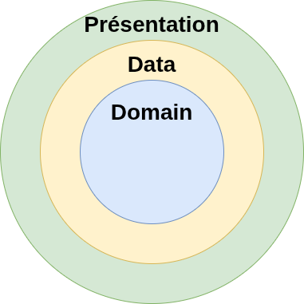
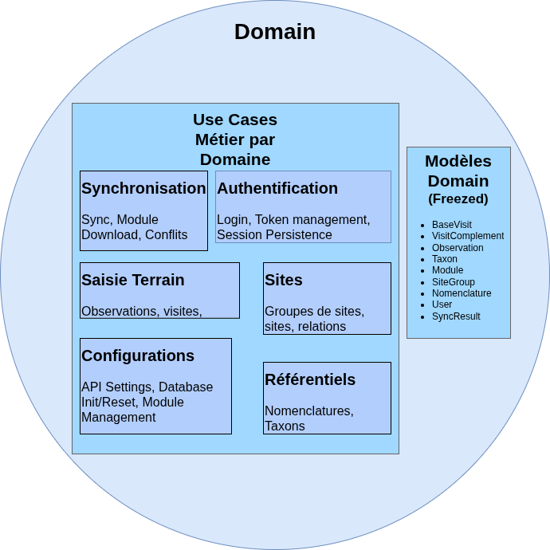
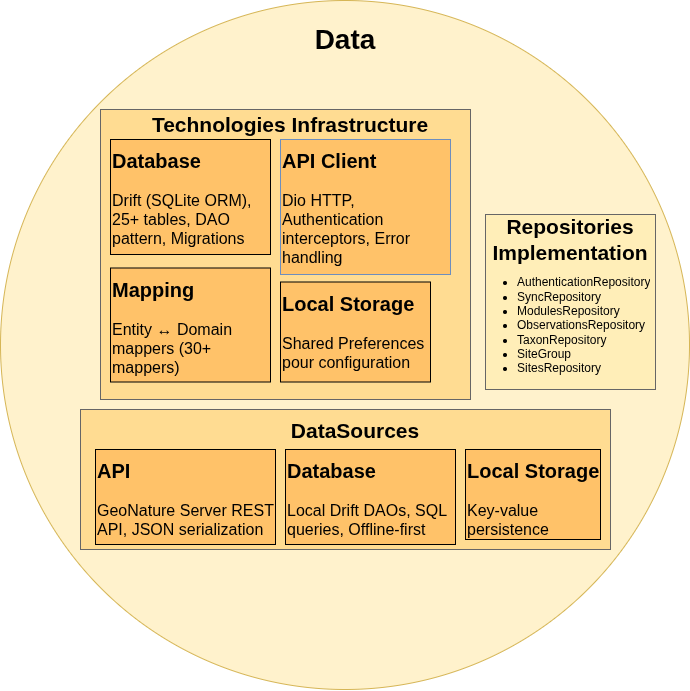
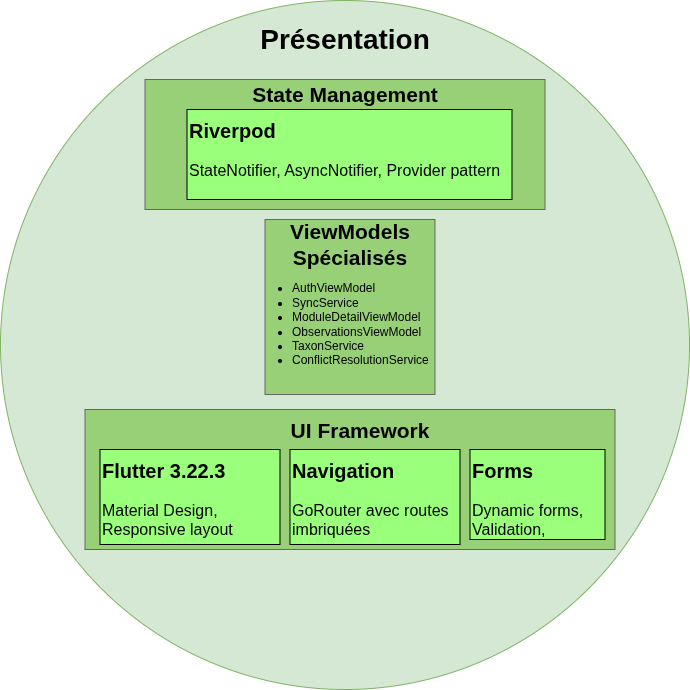
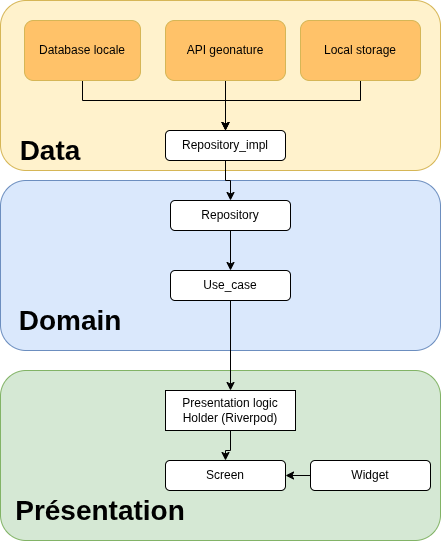

====================================================
Workshop GN Mobile Monitoring - Développement Mobile
====================================================

Formation développement mobile Flutter pour GeoNature
======================================================

.. contents:: Table des matières
   :local:
   :depth: 2

Introduction
============

Ce workshop vise à former une dizaine de participants au développement mobile avec Flutter, dans le contexte de l'application **GN Mobile Monitoring** (application mobile pour le module monitoring de GeoNature).

.. container:: info-box

   **🎯 Public cible**
   
   Géomaticiens, développeurs Python, profils techniques variés cherchant à s'initier au développement mobile.

Informations pratiques
======================

      Date et participants
      --------------------
      
      .. list-table::
         :widths: 30 70
         
         * - **📅 Dates**
           - 1er au 5 décembre 2025
         * - **👥 Participants**
           - ~10 personnes maximum
         * - **💬 Communication**
           - https://matrix.to/#/!kFgKRPJSfydPQpWPOW:matrix.org?via=matrix.org

   

Objectifs pédagogiques
=======================

À l'issue de ce workshop, les participants sauront :

1. **Développement mobile** : Comprendre les spécificités du mobile (offline-first, performances, UI tactile)
2. **Langage Dart** : Syntaxe, null-safety, async/await, collections
3. **Framework Flutter** : Widgets, layout, navigation, state management
4. **Clean Architecture** : Séparation des couches Domain/Data/Presentation
5. **Logique métier** : Identifier et isoler la logique métier
6. **Outils** : Git, Flutter DevTools, ADB, tests unitaires et d'intégration

Partie 1 : Introduction écosystème
=================================

**Contexte rapide** : GeoNature est une plateforme de gestion de données naturalistes. Le module monitoring permet la saisie de données sur différentes protocoles.
L'application mobile gn_mobile_monitoring permet la saisie terrain en mode offline.

**Démonstration** : 
Parcours utilisateur complet (login → téléchargement protocole → sélection protocole → saisie visite et observation → téléversement → synchronisation)

.. raw:: html

   

      <video width="300" autoplay loop muted controls>
         <source src="_static/workshop/ma-demo-compressed.mp4" type="video/mp4">
         Votre navigateur ne supporte pas la balise vidéo.
      </video>
   

Partie 2 : Installation et setup
================================

Installation de l'environnement de développement
------------------------------------------------

Installation de Flutter
~~~~~~~~~~~~~~~~~~~~~~~

**Sur Ubuntu/Linux** :

.. code-block:: bash

   # 1. Télécharger Flutter SDK
   cd ~/
   wget https://storage.googleapis.com/flutter_infra_release/releases/stable/linux/flutter_linux_3.22.3-stable.tar.xz
   tar xf flutter_linux_3.22.3-stable.tar.xz

   # 2. Ajouter Flutter au PATH (dans ~/.bashrc ou ~/.zshrc)
   echo 'export PATH="$HOME/flutter/bin:$PATH"' >> ~/.bashrc
   source ~/.bashrc

   # 3. Vérifier l'installation
   flutter doctor

**Sur Windows** :

1. Télécharger Flutter SDK depuis https://flutter.dev/docs/get-started/install/windows
2. Extraire dans ``C:\src\flutter`` (éviter les espaces dans le chemin)
3. Ajouter ``C:\src\flutter\bin`` au PATH système
4. Ouvrir un nouveau terminal et vérifier :

.. code-block:: powershell

   flutter doctor

Installation d'Android Studio
~~~~~~~~~~~~~~~~~~~~~~~~~~~~~

**Sur Ubuntu** :

.. code-block:: bash

   # 1. Télécharger depuis https://developer.android.com/studio
   # ou via snap
   sudo snap install android-studio --classic

   # 2. Lancer Android Studio
   android-studio

   # 3. Suivre l'assistant de configuration
   # Installer : Android SDK, Android SDK Platform-Tools, Android Emulator

**Sur Windows** :

1. Télécharger depuis https://developer.android.com/studio
2. Lancer l'installateur et suivre les instructions
3. Durant l'installation, cocher :
   - Android SDK
   - Android SDK Platform-Tools
   - Android Virtual Device

**Configuration Flutter** :

.. code-block:: bash

   # Accepter les licences Android
   flutter doctor --android-licenses

   # Vérifier que tout est OK
   flutter doctor -v

Options de développement
------------------------

.. raw:: html

   

      

         

            
📱

            <h3>Option 1 : Téléphone physique</h3>
            Recommandé
         

         
         

            

               <h4>1️⃣ Activer le mode développeur</h4>
               <ol>
                  <li><strong>Paramètres</strong> → À propos du téléphone</li>
                  <li>Taper <strong>7 fois</strong> sur "Numéro de build"</li>
                  <li><strong>Paramètres</strong> → Options pour développeurs</li>
                  <li>Activer : <strong>Débogage USB</strong></li>
               </ol>
            

            
            

               <h4>2️⃣ Connecter et développer</h4>
               <ol>
                  <li>Connecter le téléphone par USB</li>
                  <li>Autoriser le débogage sur le popup</li>
                  <li>Dans VS Code : extension <strong>Flutter</strong></li>
                  <li>Sélectionner le device en bas à droite</li>
                  <li>Terminal : <code>adb reverse tcp:8000 tcp:8000</code></li>
                  <li>Appuyer sur <strong>F5</strong> pour debugger</li>
               </ol>
            

         

      

      
      

         

            
💻

            <h3>Option 2 : Émulateur Android</h3>
            Alternative
         

         
         

            

               <h4>1️⃣ Créer un émulateur</h4>
               <ol>
                  <li>Android Studio → <strong>AVD Manager</strong></li>
                  <li><strong>Create Virtual Device</strong></li>
                  <li>Choisir : Pixel 6a</li>
                  <li>Image système : <strong>API 33</strong></li>
               </ol>
            

            
            

               <h4>2️⃣ Lancer depuis VS Code</h4>
               <ol>
                  <li><strong>Ctrl+Shift+P</strong> (palette de commandes)</li>
                  <li>Taper : <strong>Flutter: Launch Emulator</strong></li>
                  <li>Sélectionner votre émulateur</li>
                  <li>Attendre le démarrage</li>
                  <li>Appuyer sur <strong>F5</strong> pour debugger</li>
               </ol>
            

         

      

   

.. tip::
   💡 **Astuce** : Le device actif s'affiche dans la barre de statut VS Code (en bas à droite). 
   Cliquez dessus pour changer rapidement !

Installation du projet GN Mobile Monitoring
-------------------------------------------

**Repository** : https://github.com/RNF-SI/gn_mobile_monitoring.git

Installation en 4 étapes
~~~~~~~~~~~~~~~~~~~~~~~~

.. code-block:: bash

   # 1. Cloner le projet
   git clone https://github.com/RNF-SI/gn_mobile_monitoring.git
   cd gn_mobile_monitoring

   # 2. Installer les dépendances
   flutter pub get

   # 3. Générer le code automatique (OBLIGATOIRE)
   make generate_code

**4. Lancer l'application** (2 options) :

.. code-block:: bash

   # Option A : Ligne de commande
   make run

.. code-block:: text

   # Option B : VS Code/Cursor
   Appuyer sur F5 ou Run → Start Debugging

**✅ Succès** : L'app se lance avec l'écran de connexion

**❌ Problème ?** : Relancez `make generate_code` puis relancez l'app

Vérification optionnelle
~~~~~~~~~~~~~~~~~~~~~~~~

.. code-block:: bash

   # Tester que tout fonctionne
   make test-unit

La plupart des tests doivent être verts. Si beaucoup échouent, demandez de l'aide.

**En savoir plus** : Voir la section `Tests unitaires en Flutter`_ pour comprendre leur rôle.

.. note::
   **💡 make generate_code** : Cette commande génère le code pour Freezed (modèles), Drift (base de données) et Riverpod (state management). **Sans elle, l'app ne compile pas.**
   
   **Quand la relancer ?** Après chaque `git pull`, modification de modèle, ou si vous voyez des erreurs `.g.dart`.
   
   **Pour en savoir plus** : Voir `Librairies clés du projet`_ en annexe.

Partie 3 : Visite guidée du code
==========================================

Architecture Clean Architecture
^^^^^^^^^^^^^^^^^^^^^^^^^^^^^^^^

*Architecture complète de GN Mobile Monitoring montrant les 3 couches et leurs interactions*

.. admonition:: 💡 Principe fondamental
   :class: key-point
   
   Direction des dépendances : **Extérieur → Intérieur**
   
   Le Domain ne dépend de RIEN ! C'est le cœur de l'application, complètement indépendant des frameworks et technologies.

Pourquoi Clean Architecture ?
~~~~~~~~~~~~~~~~~~~~~~~~~~~~~~

**Problèmes sans architecture** :

- ❌ Logique métier mélangée avec l'UI
- ❌ Difficile à tester
- ❌ Dépendance forte aux frameworks
- ❌ Difficulté à changer de technologie (DB, API)

**Avantages de Clean Architecture** :

- ✅ **Testabilité** : Logique métier isolée et facilement testable
- ✅ **Flexibilité** : Changer DB ou API sans toucher au métier
- ✅ **Maintenabilité** : Responsabilités claires
- ✅ **Réutilisabilité** : Domain peut être réutilisé dans d'autres apps

Les 3 couches en détail
~~~~~~~~~~~~~~~~~~~~~~~~

**1. DOMAIN Layer (💼 Business Logic)** :

- Contient toute la logique métier
- Indépendant de toute technologie
- Modèles avec ``@freezed`` (immutabilité)
- Repositories = interfaces abstraites
- Use cases = une action métier = une classe

**2. DATA Layer (🔧 Technical Implementation)** :

- Implémente les détails techniques
- Data Sources : API REST, SQLite
- Entities : Représentent les tables DB
- Mappers : Convertissent Entity ↔ Domain Model
- Repository Impl : Implémente l'interface du Domain

**3. PRESENTATION Layer (🎨 User Interface)** :

- Affichage et interactions utilisateur
- Views : Widgets Flutter (pages, écrans)
- ViewModels : Gestion d'état avec Riverpod
- Widgets : Composants UI réutilisables
- Ne connaît que le **Domain** (pas la Data)

.. container:: example-box

   **Exemple : Synchro dans une vraie app**

   Supposons que tu dois synchroniser des données d'observations depuis le mobile vers le serveur. Voici comment la Clean Architecture rend cela flexible :

   .. list-table::
      :widths: 30 70

      * - **Présentation**
        - L'utilisateur tape sur un bouton « Synchroniser ». Le widget appelle un ViewModel, qui lance le use case `SyncObservations`.
      * - **Domain**
        - Le use case `SyncObservationsUseCase` décrit « synchroniser les observations », sans savoir comment ni où.
      * - **Data**
        - L'implémentation du repository (ex: `ObservationsRepositoryImpl`) effectue la synchro via API REST, ou plus tard vers un serveur local, ou un fichier...

   **Indépendance technologique :**
   
   Si demain tu veux :
   
   - synchroniser vers un fichier plutôt qu'une API ;
   - migrer de SQLite à Hive ;
   - ajouter un mode « envoi Bluetooth » ;
   
   il suffit de modifier/ajouter la couche Data, sans toucher à ta logique Domain – ni à tes widgets UI.

   .. code-block:: dart

      // (extrait simplifié)
      // DOMAIN
      abstract class ObservationsRepository {
        Future<void> sync();
      }

      class SyncObservationsUseCase {
        final ObservationsRepository repo;
        SyncObservationsUseCase(this.repo);

        Future<void> call() => repo.sync();
      }

      // DATA
      class ObservationsRepositoryImpl implements ObservationsRepository {
        @override
        Future<void> sync() async {
          // Ici, appelle soit une API, soit écrit dans un fichier, etc.
        }
      }

      // PRESENTATION
      // (Vue ou ViewModel)
      final useCase = SyncObservationsUseCase(ObservationsRepositoryImpl());
      // Un bouton appelle : await useCase();

   *Ainsi, la logique métier reste isolée, quels que soient les choix techniques du dessous.*

Inversion de Dépendances (DIP)
^^^^^^^^^^^^^^^^^^^^^^^^^^^^^^^

**Problème** : Dépendance directe entre domain (UseCase) et data (RepositoryImpl)❌

.. code-block:: text

   UseCase → RepositoryImpl (dépendance concrète)

**Solution** : Inversion ✅

.. code-block:: text

   UseCase → IRepository (interface abstraite)
                  ↑
                  |
           RepositoryImpl (implémente l'interface)

**Avantages** :

- ✅ Testabilité (mocks faciles)
- ✅ Flexibilité (changer DB/API sans toucher au métier)
- ✅ Maintenabilité (responsabilités claires)

.. container:: example-box

   **Exemple de code**

   **Interface (Domain)** :

   .. code-block:: dart
   
      // lib/domain/repository/sites_repository.dart
      abstract class SitesRepository {
        Future<List<Site>> getSites();
      }
   
   **Implémentation (Data)** :
   
   .. code-block:: dart
   
      // lib/data/repository/sites_repository_impl.dart
      class SitesRepositoryImpl implements SitesRepository {
        final SitesApi _api;
        final SitesDao _dao;
   
        @override
        Future<List<Site>> getSites() async {
          try {
            // API d'abord
            final sites = await _api.fetchSites();
            await _dao.saveSites(sites);
            return sites;
          } catch (e) {
            // Fallback DB locale
            return _dao.getSites();
          }
        }
      }
   
   **Use Case (Domain)** :
   
   .. code-block:: dart
   
      // lib/domain/usecase/get_sites_usecase.dart
      @riverpod
      class GetSitesUseCase extends _$GetSitesUseCase {
        Future<List<Site>> call() async {
          return ref.read(sitesRepositoryProvider).getSites();
        }
      }

Vue d'ensemble : Flux de données et implémentation
^^^^^^^^^^^^^^^^^^^^^^^^^^^^^^^^^^^^^^^^^^^^^^^^^^^

Ce schéma est une représentation complémentaire qui exprime le flux de données et l'implémentation concrète.

*Le Domain reste indépendant tandis que Data et Presentation implémentent les détails techniques*

Concepts clés
=============

Développement mobile
--------------------

Spécificités du mobile
~~~~~~~~~~~~~~~~~~~~~~

- **Offline-first** : L'app doit fonctionner sans connexion
- **Performances** : Device moins puissant qu'un PC
- **UI tactile** : Cibles de 48x48 dp minimum
- **Batterie** : Optimiser les opérations réseau et CPU
- **Stockage** : Limité, attention à la taille de la DB

Flutter
~~~~~~~

- ✅ Performances quasi-natives (compilé en code machine)
- ✅ Un seul codebase pour Android + iOS
- ✅ Hot reload rapide
- ✅ Widgets riches (Material Design + Cupertino)
- ⚠️ Taille de l'app plus importante

Langage Dart
-------------

Syntaxe de base
~~~~~~~~~~~~~~~

.. code-block:: dart

   // Variables
   int age = 25;
   double prix = 19.99;
   String nom = 'Alice';
   bool actif = true;

   // Null-safety
   String? nullable; // Peut être null
   String nonNull = 'value'; // Ne peut pas être null

   // Collections
   List<String> fruits = ['pomme', 'banane'];
   Map<String, int> ages = {'Alice': 25, 'Bob': 30};

   // Fonctions
   int additionner(int a, int b) => a + b;

   // Async/await
   Future<String> fetchData() async {
     await Future.delayed(Duration(seconds: 2));
     return 'Data loaded';
   }

Classes et modèles
~~~~~~~~~~~~~~~~~~

.. code-block:: dart

   // Classe simple
   class Person {
     final String name;
     final int age;

     Person(this.name, this.age);
   }

   // Avec Freezed (immutable)
   @freezed
   class User with _$User {
     const factory User({
       required int id,
       required String name,
       String? email,
     }) = _User;

     factory User.fromJson(Map<String, dynamic> json) =>
         _$UserFromJson(json);
   }

Framework Flutter
-----------------

Widgets de base
~~~~~~~~~~~~~~~

.. code-block:: dart

   // Layout vertical
   Column(
     children: [
       Text('Titre'),
       Text('Sous-titre'),
     ],
   )

   // Layout horizontal
   Row(
     children: [
       Icon(Icons.star),
       Text('5.0'),
     ],
   )

   // Container (box model)
   Container(
     width: 100,
     height: 100,
     padding: EdgeInsets.all(16),
     decoration: BoxDecoration(
       color: Colors.blue,
       borderRadius: BorderRadius.circular(8),
     ),
     child: Text('Hello'),
   )

   // Liste
   ListView.builder(
     itemCount: items.length,
     itemBuilder: (context, index) {
       return ListTile(
         title: Text(items[index].name),
       );
     },
   )

State management (Riverpod)
~~~~~~~~~~~~~~~~~~~~~~~~~~~

.. code-block:: dart

   // Provider simple
   @riverpod
   String greeting(GreetingRef ref) {
     return 'Hello';
   }

   // FutureProvider (async)
   @riverpod
   Future<String> fetchData(FetchDataRef ref) async {
     await Future.delayed(Duration(seconds: 2));
     return 'Data loaded';
   }

   // StateNotifier (état mutable)
   @riverpod
   class Counter extends _$Counter {
     @override
     int build() => 0;

     void increment() => state++;
     void decrement() => state--;
   }

   // Utilisation dans un Widget
   class MyWidget extends ConsumerWidget {
     @override
     Widget build(BuildContext context, WidgetRef ref) {
       final count = ref.watch(counterProvider);

       return Text('Count: $count');
     }
   }

.. raw:: html

   <a href="https://riverpod.dev/" target="_blank">Documentation officielle de Riverpod</a>

Qu'est-ce qu'une logique métier ?
~~~~~~~~~~~~~~~~~~~~~~~~~~~~~~~~~~

**Définition** : Les règles et processus qui définissent le comportement de l'application, indépendamment de la technologie.

**Exemples dans GeoNature** :

- ✅ Validation des données d'observation (date cohérente, espèce valide)
- ✅ Calcul de la compatibilité des modules
- ✅ Gestion des permissions CRUVED (qui peut Créer, Lire, Mettre à jour, Valider, Exporter, Supprimer)
- ✅ Synchronisation et résolution de conflits
- ✅ Filtrage des observations selon critères métier

**Contre-exemples (logique technique, pas métier)** :

- ❌ Appel HTTP avec Dio
- ❌ Requête SQL avec Drift
- ❌ Affichage d'un widget Flutter
- ❌ Navigation entre écrans

Où placer la logique métier ?
~~~~~~~~~~~~~~~~~~~~~~~~~~~~~~

**Use Cases (Domain)** : La logique métier doit être dans les Use Cases

.. code-block:: dart

   // ✅ BON : Use Case avec logique métier
   @riverpod
   class ValidateObservationUseCase extends _$ValidateObservationUseCase {
     Future<ValidationResult> call(Observation obs) async {
       // Logique métier : validation
       if (obs.date.isAfter(DateTime.now())) {
         return ValidationResult.error('Date future non autorisée');
       }

       if (obs.latitude == null || obs.longitude == null) {
         return ValidationResult.error('Coordonnées GPS requises');
       }

       return ValidationResult.success();
     }
   }

.. code-block:: dart

   // ❌ MAUVAIS : Logique métier dans un Widget
   class ObservationForm extends StatelessWidget {
     void submit() {
       // ❌ Ne pas faire ça !
       if (obs.date.isAfter(DateTime.now())) {
         showError('Date future non autorisée');
       }
     }
   }

Tests unitaires en Flutter
===========================

.. raw:: html

   

.. container:: info-box

   **🎯 Pourquoi les tests unitaires ?**
   
   Dans Clean Architecture, les tests unitaires sont essentiels pour valider que votre **logique métier** fonctionne correctement, indépendamment de l'interface utilisateur ou des services externes.

Introduction à la pyramide des tests
------------------------------------

.. image:: _static/workshop/pyramide_test.png
   :alt: Pyramide des tests
   :align: center
   :width: 70%

*Pyramide des tests : Tests unitaires (base large) → Tests d'intégration (milieu) → Tests E2E (sommet)*

.. container:: architecture-overview

   .. container:: layer-card domain
   
      **🧪 Tests unitaires**
      
      *70% de vos tests*
      
      • Rapides (< 1 seconde)
      • Isolés (pas de dépendances)
      • Testent la logique métier
      • **Domain Layer seulement**
   
   .. container:: layer-card data
   
      **🔗 Tests d'intégration**
      
      *20% de vos tests*
      
      • Plus lents (quelques secondes)
      • Testent les interactions
      • API + Database + Cache
      • **Data Layer principalement**
   
   .. container:: layer-card presentation
   
      **📱 Tests E2E**
      
      *10% de vos tests*
      
      • Très lents (minutes)
      • Interface complète
      • Parcours utilisateur
      • **Toute l'application**

Que tester avec les tests unitaires ?
-------------------------------------

Dans le contexte GN Mobile Monitoring
~~~~~~~~~~~~~~~~~~~~~~~~~~~~~~~~~~~~~

.. admonition:: ✅ À TESTER (Domain Layer)
   :class: key-point
   
   **Use Cases** : La logique métier pure
   
   • Validation des observations (dates, coordonnées)
   • Calculs de distances ou surfaces
   • Règles de compatibilité entre modules
   • Transformation et filtrage des données
   • Validation des protocoles de monitoring
   • Règles de synchronisation (conflits, merge)
   • Calculs GPS (surfaces, distances entre sites)
   • Formatage des nomenclatures
   • Validation des formulaires dynamiques
   • Logic de cache offline
   
   **Modèles** : Les objets métier
   
   • Sérialisation/désérialisation JSON
   • Méthodes `copyWith()` générées par Freezed
   • Égalité et hashCode
   • Getters calculés et validation
   
   **Value Objects** : Objets métier immutables
   
   • Coordonnées GPS, Email, ID utilisateur
   • Validation à la création
   • Comportements métier spécifiques

.. admonition:: ❌ À NE PAS TESTER (en unitaire)
   :class: warning
   
   **Évitez de tester** :
   
   • Widgets Flutter (→ Tests de widgets séparés)
   • Appels API HTTP (→ Tests d'intégration)
   • Base de données SQLite (→ Tests d'intégration)  
   • Navigation entre écrans (→ Tests E2E)
   • Providers Riverpod (→ Tests d'intégration)

Configuration des tests dans le projet
--------------------------------------

Structure des tests
~~~~~~~~~~~~~~~~~~~

.. code-block:: text

   test/
   ├── unit/
   │   ├── domain/
   │   │   ├── model/
   │   │   │   └── observation_test.dart
   │   │   └── usecase/
   │   │       └── validate_observation_test.dart
   │   └── data/
   │       └── mapper/
   │           └── observation_mapper_test.dart
   ├── integration/
   │   └── api/
   │       └── sites_api_test.dart
   └── test_helpers/
       ├── mock_providers.dart
       └── test_data.dart

Commandes utiles
~~~~~~~~~~~~~~~~

.. code-block:: bash

   # Lancer tous les tests unitaires
   make test-unit
   # ou
   flutter test test/unit/

   # Lancer un test spécifique
   flutter test test/unit/domain/usecase/validate_observation_test.dart

   # Tests avec couverture de code
   flutter test --coverage

   # Tests en mode watch (relance automatique)
   flutter test --watch

   # Lancer les tests d'intégration (nécessite .env.test)
   make test-integration

   # Lancer TOUS les tests 
   make test-all

   # Tests avec couverture
   flutter test --coverage --exclude-tags=integration

Exemples de tests concrets
--------------------------
  Exemples de tests spécifiques au monitoring
  -------------------------------------------

  Test de validation de formulaire dynamique
  ~~~~~~~~~~~~~~~~~~~~~~~~~~~~~~~~~~~~~~~~~~~

  .. code-block:: dart
     :caption: Issu de form_config_parser_test.dart

     test('should parse conditional fields correctly', () {
       // Arrange - Configuration JSON du module
       final configJson = {
         'fields': [
           {'name': 'nb_individuals', 'type': 'number', 'required': true},
           {'name': 'sex', 'type': 'nomenclature', 'hidden': 'nb_individuals == 0'}
         ]
       };

       // Act
       final config = FormConfigParser.parse(configJson);

       // Assert
       expect(config.shouldShowField('sex', {'nb_individuals': 0}), false);
       expect(config.shouldShowField('sex', {'nb_individuals': 5}), true);
     });

  Test de logique de synchronisation
  ~~~~~~~~~~~~~~~~~~~~~~~~~~~~~~~~~~

  .. code-block:: dart
     :caption: Issu de sync_cache_manager_test.dart

     test('should handle sync conflicts correctly', () async {
       // Arrange - Données locales vs serveur
       final localVisit = Visit(id: 1, lastModified: yesterday);
       final serverVisit = Visit(id: 1, lastModified: today);
       
       // Act
       final conflict = syncManager.detectConflict(localVisit, serverVisit);
       
       // Assert
       expect(conflict.type, ConflictType.dataModified);
       expect(conflict.requiresUserChoice, true);
     });

  Test de calculs GPS terrain
  ~~~~~~~~~~~~~~~~~~~~~~~~~~~

  .. code-block:: dart
     :caption: Test spécifique aux données de terrain

     test('should calculate site area from GPS points', () {
       // Arrange - Coordonnées d'un site
       final gpsPoints = [
         GPSPoint(lat: 45.123, lng: 5.456),
         GPSPoint(lat: 45.125, lng: 5.459),
         GPSPoint(lat: 45.121, lng: 5.461),
         GPSPoint(lat: 45.123, lng: 5.456), // Fermeture du polygone
       ];
       
       // Act
       final area = SiteCalculator.calculateArea(gpsPoints);
       
       // Assert
       expect(area, closeTo(0.084, 0.01)); // ~840m² ± 10m²
     });

Test d'un Use Case avec mocks
~~~~~~~~~~~~~~~~~~~~~~~~~~~~~

**Objectif** : Tester la logique métier de façon isolée, sans dépendances externes.

.. code-block:: dart
   :linenos:
   :emphasize-lines: 14, 22-23
   :caption: test/unit/domain/usecase/validate_observation_test.dart

   import 'package:flutter_test/flutter_test.dart';
   import 'package:mockito/mockito.dart';

   void main() {
     group('ValidateObservationUseCase', () {
       late ValidateObservationUseCase useCase;

       setUp(() {
         useCase = ValidateObservationUseCase();
       });

       test('should reject future date', () async {
         // Arrange
         final futureObs = Observation(
           id: '1',
           date: DateTime.now().add(Duration(days: 1)), // ← Date future
           latitude: 45.0,
           longitude: 5.0,
         );

         // Act
         final result = await useCase.call(futureObs);

         // Assert
         expect(result.isValid, false);
         expect(result.error, contains('Date future'));
       });

       test('should reject missing coordinates', () async {
         // Arrange
         final invalidObs = Observation(
           id: '2',
           date: DateTime.now(),
           latitude: null, // ← Coordonnées manquantes
           longitude: null,
         );

         // Act
         final result = await useCase.call(invalidObs);

         // Assert
         expect(result.isValid, false);
         expect(result.error, contains('Coordonnées'));
       });

       test('should accept valid observation', () async {
         // Arrange
         final validObs = Observation(
           id: '3',
           date: DateTime.now(),
           latitude: 45.0,
           longitude: 5.0,
         );

         // Act
         final result = await useCase.call(validObs);

         // Assert
         expect(result.isValid, true);
         expect(result.error, isNull);
       });
     });
   }

Test d'un modèle Freezed
~~~~~~~~~~~~~~~~~~~~~~~~

.. code-block:: dart
   :linenos:
   :caption: test/unit/domain/model/observation_test.dart

   import 'dart:convert';
   import 'package:flutter_test/flutter_test.dart';

   void main() {
     group('Observation Model', () {
       const testObservation = Observation(
         id: '123',
         date: '2023-12-01T10:30:00Z',
         species: 'Salamandre tachetée',
         latitude: 45.123,
         longitude: 5.456,
       );

       test('should serialize to JSON correctly', () {
         // Act
         final json = testObservation.toJson();

         // Assert
         expect(json['id'], '123');
         expect(json['species'], 'Salamandre tachetée');
         expect(json['latitude'], 45.123);
       });

       test('should deserialize from JSON correctly', () {
         // Arrange
         final jsonString = '''
         {
           "id": "456",
           "date": "2023-12-02T14:15:00Z",
           "species": "Triton palmé",
           "latitude": 46.0,
           "longitude": 6.0
         }
         ''';

         // Act
         final observation = Observation.fromJson(
           jsonDecode(jsonString)
         );

         // Assert
         expect(observation.id, '456');
         expect(observation.species, 'Triton palmé');
         expect(observation.latitude, 46.0);
       });

       test('copyWith should work correctly', () {
         // Act
         final modified = testObservation.copyWith(
           species: 'Triton crêté',
           latitude: 47.0,
         );

         // Assert
         expect(modified.id, '123'); // ← Inchangé
         expect(modified.species, 'Triton crêté'); // ← Modifié
         expect(modified.latitude, 47.0); // ← Modifié
         expect(modified.longitude, 5.456); // ← Inchangé
       });

       test('equality should work correctly', () {
         // Arrange
         const identical = Observation(
           id: '123',
           date: '2023-12-01T10:30:00Z',
           species: 'Salamandre tachetée',
           latitude: 45.123,
           longitude: 5.456,
         );

         const different = Observation(
           id: '999',
           date: '2023-12-01T10:30:00Z',
           species: 'Salamandre tachetée',
           latitude: 45.123,
           longitude: 5.456,
         );

         // Assert
         expect(testObservation, equals(identical));
         expect(testObservation, isNot(equals(different)));
       });
     });
   }

Test d'un Repository avec mocks
~~~~~~~~~~~~~~~~~~~~~~~~~~~~~~~

.. code-block:: dart
   :linenos:
   :emphasize-lines: 8, 18, 27
   :caption: test/unit/domain/usecase/get_sites_test.dart

   import 'package:flutter_test/flutter_test.dart';
   import 'package:mockito/mockito.dart';
   import 'package:mockito/annotations.dart';

   // Génère automatiquement MockSitesRepository
   @GenerateMocks([SitesRepository])
   void main() {
     late MockSitesRepository mockRepository;
     late GetSitesUseCase useCase;

     setUp(() {
       mockRepository = MockSitesRepository();
       useCase = GetSitesUseCase(mockRepository);
     });

     group('GetSitesUseCase', () {
       test('should return sites from repository', () async {
         // Arrange - Mock du comportement
         final expectedSites = [
           Site(id: 1, name: 'Site A', coordinates: [45.0, 5.0]),
           Site(id: 2, name: 'Site B', coordinates: [46.0, 6.0]),
         ];
         when(mockRepository.getSites('POPAAMPHIBIEN'))
             .thenAnswer((_) async => expectedSites);

         // Act
         final result = await useCase.call('POPAAMPHIBIEN');

         // Assert
         expect(result, expectedSites);
         verify(mockRepository.getSites('POPAAMPHIBIEN')).called(1);
       });

       test('should handle repository error', () async {
         // Arrange
         when(mockRepository.getSites(any))
             .thenThrow(Exception('Network error'));

         // Act & Assert
         expect(
           () => useCase.call('POPAAMPHIBIEN'),
           throwsA(isA<Exception>()),
         );
       });
     });
   }

Bonnes pratiques pour les tests
-------------------------------

Structure AAA (Arrange-Act-Assert)
~~~~~~~~~~~~~~~~~~~~~~~~~~~~~~~~~~

.. admonition:: 📝 Pattern AAA
   :class: key-point
   
   **Arrange** : Préparer les données et mocks
   
   **Act** : Exécuter la fonction à tester
   
   **Assert** : Vérifier le résultat attendu

.. code-block:: dart

   test('should calculate distance correctly', () {
     // Arrange ← 🔧 Préparation
     final pointA = Coordinate(45.0, 5.0);
     final pointB = Coordinate(45.1, 5.1);
     
     // Act ← ⚡ Exécution
     final distance = calculateDistance(pointA, pointB);
     
     // Assert ← ✅ Vérification
     expect(distance, closeTo(15.7, 0.1)); // ~15.7km ± 0.1
   });

Nommage des tests
~~~~~~~~~~~~~~~~

.. code-block:: dart

   // ✅ BON - Décrit le comportement
   test('should return empty list when no observations found')
   test('should throw exception when user is not authenticated')
   test('should validate email format correctly')

   // ❌ MAUVAIS - Trop vague
   test('test login')
   test('check email') 
   test('repository test')

Gestion des mocks
~~~~~~~~~~~~~~~~

.. code-block:: bash

   # Générer automatiquement les mocks
   flutter packages pub run build_runner build

.. code-block:: dart

   // Dans le fichier de test
   @GenerateMocks([
     SitesRepository,
     AuthRepository, 
     DatabaseProvider,
   ])

Couverture de code
~~~~~~~~~~~~~~~~~

.. code-block:: bash

   # Générer un rapport de couverture
   flutter test --coverage
   
   # Voir le rapport dans un navigateur
   genhtml coverage/lcov.info -o coverage/html
   open coverage/html/index.html

.. tip::
   🎯 **Objectif couverture** : Visez 80%+ pour le Domain Layer, moins critique pour Presentation/Data.

Debugging des tests
~~~~~~~~~~~~~~~~~~

.. code-block:: dart

   test('debug example', () async {
     // Afficher des valeurs pendant le test
     print('Value: $result');
     
     // Débugger avec le debugger
     debugger(); // Pause ici si lancé avec --enable-vm-service
     
     expect(result, isNotNull);
   });

.. code-block:: bash

   # Lancer les tests avec debug
   flutter test --enable-vm-service test/unit/specific_test.dart

Intégration dans le workflow de développement
--------------------------------------------

TDD (Test-Driven Development)
~~~~~~~~~~~~~~~~~~~~~~~~~~~~

.. admonition:: 🔄 Cycle TDD
   :class: key-point
   
   1. **🔴 RED** : Écrire un test qui échoue
   2. **🟢 GREEN** : Écrire le minimum de code pour passer le test  
   3. **🔵 REFACTOR** : Améliorer le code tout en gardant les tests verts

.. code-block:: dart

   // 1. RED - Test qui échoue
   test('should calculate tax correctly', () {
     final calculator = TaxCalculator();
     expect(calculator.calculate(100), 20.0); // 20% TVA
   }); // ← Classe TaxCalculator n'existe pas encore

   // 2. GREEN - Code minimal qui marche
   class TaxCalculator {
     double calculate(double amount) => amount * 0.2;
   }

   // 3. REFACTOR - Améliorer sans casser
   class TaxCalculator {
     final double _taxRate;
     TaxCalculator(this._taxRate);
     
     double calculate(double amount) {
       if (amount < 0) throw ArgumentError('Amount cannot be negative');
       return amount * _taxRate;
     }
   }

Hooks Git (pre-commit)
~~~~~~~~~~~~~~~~~~~~~

.. code-block:: bash

   # .git/hooks/pre-commit
   #!/bin/sh
   echo "Running unit tests..."
   flutter test test/unit/ || exit 1
   echo "All tests passed!"

CI/CD Integration
~~~~~~~~~~~~~~~~

.. code-block:: yaml

   # .github/workflows/test.yml
   name: Tests
   on: [push, pull_request]
   
   jobs:
     test:
       runs-on: ubuntu-latest
       steps:
         - uses: actions/checkout@v3
         - uses: subosito/flutter-action@v2
         - run: flutter pub get
         - run: make generate_code
         - run: flutter test test/unit/
         - run: flutter test --coverage
         - uses: codecov/codecov-action@v3

.. code-block:: dart

   void main() {
     late MockSitesRepository mockRepository;
     late GetSitesUseCase useCase;

     setUp(() {
       mockRepository = MockSitesRepository();
       // Setup avec Riverpod ProviderContainer
     });

     group('GetSitesUseCase', () {
       test('should return list of sites', () async {
         // Arrange
         final expectedSites = [
           Site(id: 1, name: 'Site 1', code: 'S1'),
           Site(id: 2, name: 'Site 2', code: 'S2'),
         ];
         when(mockRepository.getSites())
             .thenAnswer((_) async => expectedSites);

         // Act
         final result = await useCase.call();

         // Assert
         expect(result, expectedSites);
         verify(mockRepository.getSites()).called(1);
       });
     });
   }

Tests d'intégration
~~~~~~~~~~~~~~~~~~~

**Objectif** : Tester les flux complets avec un serveur réel.

**Exemple** :

.. code-block:: dart

   @Tags(['integration'])
   void main() {
     late TestServerConfig config;

     setUpAll(() async {
       config = await TestEnvironmentSetup.getConfig();
     });

     test('should login and fetch sites', () async {
       // Login
       await AuthHelper.loginWithTestConfig(config);

       // Récupérer sites
       final sites = await sitesRepository.getSites('POPAAMPHIBIEN');

       // Assert
       expect(sites, isNotEmpty);
     });
   }

Exécution
~~~~~~~~~

.. code-block:: bash

   # Tests unitaires uniquement
   flutter test --exclude-tags=integration

   # Tests d'intégration uniquement
   flutter test test/integration/ --tags=integration

   # Tous les tests
   flutter test

Configuration des tests d'intégration
-------------------------------------

Variables d'environnement requises
~~~~~~~~~~~~~~~~~~~~~~~~~~~~~~~~~~~

.. code-block:: bash
   :caption: .env.test (copier depuis .env.test.example)

   # Serveur GeoNature de test
   GEONATURE_API_URL=https://demo.geonature.fr
   TEST_USERNAME=test@geonature.fr
   TEST_PASSWORD=password

   # Module de test
   TEST_MODULE_CODE=POPAAMPHIBIEN
   TEST_SITE_GROUP_ID=1

Tags de tests
~~~~~~~~~~~~~

.. code-block:: dart

   @Tags(['integration'])
   void main() {
      group('Sites API Integration', () {
      // Tests nécessitant un serveur réel
      });
   }

Tests d'intégration spécifiques
-------------------------------

Configuration du serveur de test
~~~~~~~~~~~~~~~~~~~~~~~~~~~~~~~~

.. admonition:: 🔧 Setup intégration
   :class: key-point

   Avant de lancer les tests d'intégration :

   1. Copiez ``.env.test.example`` vers ``.env.test``
   2. Configurez les credentials du serveur de test
   3. Assurez-vous que le serveur GeoNature est accessible
   4. Lancez : ``make test-integration``

.. code-block:: dart
   :caption: test/integration/auth_integration_test.dart

   @Tags(['integration'])
   group('Authentication Integration', () {
      test('should authenticate against real server', () async {
      // Utilise les vraies API GeoNature
      final authRepo = AuthenticationRepositoryImpl();
      final result = await authRepo.login(
         email: testConfig.username,
         password: testConfig.password,
      );

      expect(result.isSuccess, true);
      expect(result.token, isNotEmpty);
      });
   });

  Métriques du projet GN Mobile
  -----------------------------

  .. container:: metrics-grid

     **📊 Tests actuels** (au 26/11/2024)

     • **Tests unitaires** : ~80 fichiers de test
     • **Tests d'intégration** : en cours de développement
     • **Coverage Domain** : ~85% (use cases bien testés)
     • **Coverage Data** : ~70% (repositories et mappers)
     • **Coverage Presentation** : ~60% (widgets et viewmodels)

Ressources techniques
=====================

Bibliothèques utilisées
------------------------

Packages principaux
~~~~~~~~~~~~~~~~~~~

.. list-table::
   :header-rows: 1
   :widths: 20 40 40

   * - Package
     - Description
     - Documentation
   * - ``riverpod``
     - State management
     - https://riverpod.dev/
   * - ``freezed``
     - Modèles immutables
     - https://pub.dev/packages/freezed
   * - ``drift``
     - SQLite ORM
     - https://drift.simonbinder.eu/
   * - ``dio``
     - HTTP client
     - https://pub.dev/packages/dio
   * - ``go_router``
     - Navigation
     - https://pub.dev/packages/go_router
   * - ``flutter_hooks``
     - Hooks React-like
     - https://pub.dev/packages/flutter_hooks

Packages pour le workshop
~~~~~~~~~~~~~~~~~~~~~~~~~~

.. list-table::
   :header-rows: 1
   :widths: 20 40 40

   * - Package
     - Usage
     - Documentation
   * - ``flutter_map``
     - Carte interactive (OpenStreetMap)
     - https://docs.fleaflet.dev/
   * - ``fl_chart``
     - Graphiques (bar, line, pie)
     - https://pub.dev/packages/fl_chart
   * - ``csv``
     - Export CSV
     - https://pub.dev/packages/csv
   * - ``share_plus``
     - Partage de fichiers
     - https://pub.dev/packages/share_plus

Commandes essentielles
-----------------------

Flutter
~~~~~~~

.. code-block:: bash

   # Lancer l'app
   flutter run

   # Choisir un device
   flutter devices
   flutter run -d <device-id>

   # Hot reload (dans le terminal)
   r          # Hot reload
   R          # Hot restart
   q          # Quitter

   # Tests
   flutter test
   flutter test --coverage

   # Build
   flutter build apk           # Android APK
   flutter build appbundle     # Android App Bundle
   flutter build ios           # iOS

   # Nettoyage
   flutter clean
   flutter pub get

Make (shortcuts du projet)
~~~~~~~~~~~~~~~~~~~~~~~~~~~

.. code-block:: bash

   make run                # Lancer l'app
   make test-unit          # Tests unitaires seulement
   make format             # Formater le code
   make analyze            # Analyser le code
   make generate_code      # Générer code (Freezed, Drift)
   make apk                # Build APK Android
   make aab                # Build App Bundle Android

ADB (Android Debug Bridge)
~~~~~~~~~~~~~~~~~~~~~~~~~~~

.. code-block:: bash

   # Devices
   adb devices

   # Logs
   adb logcat
   adb logcat | grep flutter

   # Screenshots
   adb exec-out screencap -p > screenshot.png

   # Base de données
   adb shell run-as com.example.gn_mobile_monitoring
   cd databases
   ls
   # Copier en local
   adb pull /data/data/com.example.gn_mobile_monitoring/databases/app.db

Git
~~~

.. code-block:: bash

   # Créer une branche
   git checkout -b feature/nom-feature

   # Status
   git status

   # Commit
   git add .
   git commit -m "feat: description"

   # Push
   git push origin feature/nom-feature

   # Mettre à jour depuis develop
   git checkout develop
   git pull
   git checkout feature/nom-feature
   git merge develop

Troubleshooting
===============

Problèmes courants
------------------

Erreur de génération de code
~~~~~~~~~~~~~~~~~~~~~~~~~~~~~

**Symptôme** : ``flutter pub run build_runner build`` échoue

**Solution** :

.. code-block:: bash

   rm -rf .dart_tool/build
   flutter clean
   flutter pub get
   make generate_code

Tests qui échouent
~~~~~~~~~~~~~~~~~~

**Symptôme** : ``flutter test`` échoue

**Solutions** :

1. Vérifier que le code compile : ``make analyze``
2. Vérifier les imports
3. Lancer les tests un par un pour isoler le problème
4. Vérifier les mocks (annotations ``@GenerateMocks``)

Problèmes de navigation
~~~~~~~~~~~~~~~~~~~~~~~~

**Symptôme** : ``context.go('/ma-page')`` ne fonctionne pas

**Solutions** :

1. Vérifier que la route est définie dans ``app_router.dart``
2. Vérifier que le path commence par ``/``
3. Utiliser ``context.push()`` au lieu de ``context.go()`` si besoin de revenir

Problèmes Riverpod
~~~~~~~~~~~~~~~~~~

**Symptôme** : Provider non trouvé

**Solutions** :

1. Vérifier que ``make generate_code`` a été exécuté
2. Vérifier les imports (``part`` et ``part of``)
3. Vérifier que le provider est annoté avec ``@riverpod``

Problèmes de base de données
~~~~~~~~~~~~~~~~~~~~~~~~~~~~~

**Symptôme** : Erreur Drift "table doesn't exist"

**Solution** :

.. code-block:: bash

   # Supprimer la DB de l'émulateur
   adb shell run-as com.example.gn_mobile_monitoring
   cd databases
   rm app.db
   # Relancer l'app

Liens utiles
============

Documentation officielle
------------------------

- Flutter : https://docs.flutter.dev/
- Dart Language Tour : https://dart.dev/guides/language/language-tour
- Riverpod : https://riverpod.dev/
- Drift : https://drift.simonbinder.eu/

Projet GeoNature
----------------

- GeoNature Docs : https://docs.geonature.fr/
- gn_module_monitoring : https://github.com/PnX-SI/gn_module_monitoring
- gn_mobile_monitoring : https://github.com/PnX-SI/gn_mobile_monitoring

Outils
------

- VS Code : https://code.visualstudio.com/
- Android Studio : https://developer.android.com/studio
- DB Browser for SQLite : https://sqlitebrowser.org/
- Postman (test API) : https://www.postman.com/

Annexes
=======

.. raw:: html

   

   

Checklist préparation
---------------------

Avant le workshop
~~~~~~~~~~~~~~~~~

.. code-block:: text

   ☐ Documentation relue et corrigée
   ☐ Serveur GeoNature de test accessible
   ☐ Modules POPAAMPHIBIEN et POPREPTILE installés
   ☐ 10 comptes utilisateurs créés
   ☐ Issues GitHub créées avec labels
   ☐ Canal Slack/Discord créé
   ☐ Email pré-workshop envoyé
   ☐ Tests unitaires passent à 100%

Pendant la réunion
~~~~~~~~~~~~~~~~~~~

.. code-block:: text

   ☐ Présentation GeoNature + démo
   ☐ Installation pour tous les participants
   ☐ Clone + pub get + generate_code OK
   ☐ Configuration .env.test
   ☐ Premier lancement validé
   ☐ Tests unitaires passent
   ☐ Présentation architecture
   ☐ Attribution features
   ☐ Accès documentation

Critères de succès
------------------

.. code-block:: text

   ☐ Tous les participants ont l'environnement fonctionnel
   ☐ Au moins 4 features sur 6 complétées (même partiellement)
   ☐ Pull Requests créées avec code testé
   ☐ Démos réussies le vendredi
   ☐ Feedback positif des participants
   ☐ Au moins 80% des participants se sentent capables de continuer à contribuer

Librairies clés du projet
--------------------------

Cette section détaille les librairies essentielles qui nécessitent la génération de code.

Dio - Client HTTP
~~~~~~~~~~~~~~~~~

**Qu'est-ce que c'est ?**

Dio est un client HTTP puissant pour Dart qui gère les requêtes réseau vers l'API GeoNature.

**Pourquoi l'utiliser ?**

.. container:: architecture-overview

   .. container:: layer-card data
   
      **✅ Avantages**
      
      • **Intercepteurs** : Gestion automatique des tokens, logs
      • **Gestion d'erreurs** : Retry automatique, timeout
      • **Upload/Download** : Progress, annulation
      • **Offline** : Cache et synchronisation différée

**Exemple concret dans le projet :**

.. code-block:: dart
   :linenos:
   :caption: lib/data/datasource/geonature_api_client.dart

   @riverpod
   Dio geoNatureApiClient(GeoNatureApiClientRef ref) {
     final dio = Dio(BaseOptions(
       baseUrl: 'https://api.geonature.fr',
       connectTimeout: Duration(seconds: 10),
       receiveTimeout: Duration(seconds: 30),
     ));

     // Intercepteur pour les tokens
     dio.interceptors.add(InterceptorsWrapper(
       onRequest: (options, handler) async {
         final token = await storage.getToken();
         if (token != null) {
           options.headers['Authorization'] = 'Bearer $token';
         }
         handler.next(options);
       },
       onError: (error, handler) {
         if (error.response?.statusCode == 401) {
           // Token expiré, rediriger vers login
           ref.read(authViewModelProvider.notifier).logout();
         }
         handler.next(error);
       },
     ));

     return dio;
   }

**Utilisation pratique :**

.. code-block:: dart

   final apiClient = ref.read(geoNatureApiClientProvider);
   
   // GET - Récupérer les observations
   final response = await apiClient.get('/monitoring/observations');
   final observations = response.data;
   
   // POST - Créer une observation
   await apiClient.post('/monitoring/observations', data: {
     'date': observation.date.toIso8601String(),
     'species_id': observation.speciesId,
     'coordinates': [observation.longitude, observation.latitude],
   });
   
   // Upload avec progress
   await apiClient.post('/upload', data: FormData.fromMap({
     'file': await MultipartFile.fromFile(imagePath),
   }), onSendProgress: (sent, total) {
     print('Progress: ${(sent / total * 100).toStringAsFixed(1)}%');
   });

Freezed - Modèles immutables
~~~~~~~~~~~~~~~~~~~~~~~~~~~~

**Qu'est-ce que c'est ?**

Freezed est une librairie qui génère automatiquement des classes **immutables** avec toutes les méthodes utiles (copyWith, toString, equality, hashCode, JSON serialization).

**Pourquoi l'utiliser ?**

.. container:: architecture-overview

   .. container:: layer-card domain
   
      **✅ Avantages**
      
      • **Immutabilité** : Objets non modifiables
      • **Type safety** : Détection d'erreurs à la compilation
      • **Moins de boilerplate** : Code généré automatiquement
      • **JSON support** : Sérialisation automatique

**Exemple concret dans le projet :**

.. code-block:: dart
   :linenos:
   :caption: lib/domain/model/observation.dart

   @freezed
   class Observation with _$Observation {
     const factory Observation({
       required String id,
       required DateTime date,
       required double latitude,
       required double longitude,
       String? species,
       String? comment,
     }) = _Observation;

     factory Observation.fromJson(Map<String, dynamic> json) =>
         _$ObservationFromJson(json);
   }

**Code généré automatiquement :**

.. code-block:: dart

   // Dans observation.freezed.dart (généré)
   extension ObservationMethods on Observation {
     // Copie avec modifications
     Observation copyWith({
       String? id,
       DateTime? date,
       String? species,
       // ... autres champs
     });
     
     // Conversion JSON
     Map<String, dynamic> toJson();
     
     // Égalité et hashCode automatiques
     @override
     bool operator ==(Object other);
     
     @override
     int get hashCode;
   }

**Utilisation pratique :**

.. code-block:: dart

   // Créer une observation
   final obs = Observation(
     id: '123',
     date: DateTime.now(),
     latitude: 45.0,
     longitude: 5.0,
   );

   // Modifier (crée une nouvelle instance)
   final modifiedObs = obs.copyWith(
     species: 'Salamandre tachetée',
     comment: 'Observée sous un rocher',
   );

   // JSON
   final json = obs.toJson(); // Map<String, dynamic>
   final fromJson = Observation.fromJson(json); // Observation

Drift - Base de données SQLite
~~~~~~~~~~~~~~~~~~~~~~~~~~~~~~

**Qu'est-ce que c'est ?**

Drift est un ORM (Object-Relational Mapping) pour SQLite qui génère du code type-safe pour les requêtes de base de données.

**Pourquoi l'utiliser ?**

.. container:: architecture-overview

   .. container:: layer-card data
   
      **✅ Avantages**
      
      • **Type safety** : Requêtes vérifiées à la compilation
      • **Performance** : Requêtes compilées et optimisées
      • **Offline-first** : SQLite embarqué dans l'app
      • **Migration** : Gestion automatique des changements de schéma

**Exemple concret dans le projet :**

.. code-block:: dart
   :linenos:
   :caption: lib/data/database/tables/observations_table.dart

   class Observations extends Table {
     TextColumn get id => text()();
     DateTimeColumn get date => dateTime()();
     RealColumn get latitude => real()();
     RealColumn get longitude => real()();
     TextColumn get species => text().nullable()();
     TextColumn get comment => text().nullable()();
     BoolColumn get isSynced => boolean().withDefault(const Constant(false))();

     @override
     Set<Column> get primaryKey => {id};
   }

**DAO généré automatiquement :**

.. code-block:: dart
   :linenos:
   :caption: lib/data/database/dao/observations_dao.dart

   @DriftAccessor(tables: [Observations])
   class ObservationsDao extends DatabaseAccessor<AppDatabase>
       with _$ObservationsDaoMixin {
     
     ObservationsDao(AppDatabase db) : super(db);

     // Requêtes générées automatiquement
     Future<List<Observation>> getAllObservations() => 
         select(observations).get();

     Future<List<Observation>> getUnsyncedObservations() =>
         (select(observations)..where((o) => o.isSynced.equals(false))).get();

     Future<void> insertObservation(ObservationsCompanion observation) =>
         into(observations).insert(observation);

     Future<void> markAsSynced(String id) =>
         (update(observations)..where((o) => o.id.equals(id)))
             .write(ObservationsCompanion(isSynced: Value(true)));
   }

**Utilisation pratique :**

.. code-block:: dart

   final dao = database.observationsDao;

   // Insérer une observation
   await dao.insertObservation(
     ObservationsCompanion(
       id: Value('obs_123'),
       date: Value(DateTime.now()),
       latitude: Value(45.0),
       longitude: Value(5.0),
       species: Value('Salamandre tachetée'),
     ),
   );

   // Récupérer les observations non synchronisées
   final unsynced = await dao.getUnsyncedObservations();

   // Marquer comme synchronisée
   await dao.markAsSynced('obs_123');

Riverpod - State Management
~~~~~~~~~~~~~~~~~~~~~~~~~~~

**Qu'est-ce que c'est ?**

Riverpod est une librairie de gestion d'état qui utilise la génération de code pour créer des providers type-safe et performants.

**Pourquoi l'utiliser ?**

.. container:: architecture-overview

   .. container:: layer-card presentation
   
      **✅ Avantages**
      
      • **Type safety** : Providers typés automatiquement
      • **Performance** : Recalcul uniquement si nécessaire
      • **Testabilité** : Facile à mocker et tester
      • **Developer Experience** : Auto-complétion parfaite

**Exemple concret dans le projet :**

.. code-block:: dart
   :linenos:
   :caption: lib/presentation/viewmodel/observations_viewmodel.dart

   @riverpod
   class ObservationsViewModel extends _$ObservationsViewModel {
     @override
     Future<List<Observation>> build() async {
       // Récupérer les observations depuis le repository
       final repository = ref.read(observationsRepositoryProvider);
       return repository.getObservations();
     }

     Future<void> addObservation(Observation observation) async {
       // Mettre l'état en loading
       state = const AsyncLoading();
       
       try {
         final repository = ref.read(observationsRepositoryProvider);
         await repository.addObservation(observation);
         
         // Recharger la liste
         ref.invalidateSelf();
       } catch (error) {
         state = AsyncError(error, StackTrace.current);
       }
     }

     Future<void> syncObservations() async {
       final repository = ref.read(observationsRepositoryProvider);
       await repository.syncWithServer();
       ref.invalidateSelf();
     }
   }

**Provider généré automatiquement :**

.. code-block:: dart

   // Dans observations_viewmodel.g.dart (généré)
   final observationsViewModelProvider = 
       AsyncNotifierProvider.autoDispose<ObservationsViewModel, List<Observation>>(
     ObservationsViewModel.new,
   );

**Utilisation dans un Widget :**

.. code-block:: dart
   :linenos:
   :caption: lib/presentation/view/observations_list_page.dart

   class ObservationsListPage extends ConsumerWidget {
     @override
     Widget build(BuildContext context, WidgetRef ref) {
       final observationsAsync = ref.watch(observationsViewModelProvider);
       
       return observationsAsync.when(
         loading: () => const CircularProgressIndicator(),
         error: (error, stack) => Text('Erreur: $error'),
         data: (observations) => ListView.builder(
           itemCount: observations.length,
           itemBuilder: (context, index) {
             final obs = observations[index];
             return ListTile(
               title: Text(obs.species ?? 'Espèce inconnue'),
               subtitle: Text('${obs.date}'),
               trailing: IconButton(
                 icon: Icon(Icons.sync),
                 onPressed: () {
                   ref.read(observationsViewModelProvider.notifier)
                       .syncObservations();
                 },
               ),
             );
           },
         ),
       );
     }
   }

Pourquoi ces 3 librairies ensemble ?
~~~~~~~~~~~~~~~~~~~~~~~~~~~~~~~~~~~~

.. admonition:: 🔄 Écosystème cohérent
   :class: key-point
   
   **Freezed + Drift + Riverpod** forment un écosystème parfaitement intégré :
   
   1. **Freezed** : Modèles immutables type-safe
   2. **Drift** : Persistance locale avec type safety
   3. **Riverpod** : State management réactif et performant
   
   **Résultat** : Application robuste, performante et maintenable !

**Flux de données typique :**

.. code-block:: text

   User Action → Riverpod Provider → Repository → Drift DAO → SQLite
                                          ↓
   UI Update ← Riverpod State ← Domain Model ← Freezed Model ← Database

**Génération de code nécessaire :**

.. code-block:: bash

   # Cette commande génère TOUT le code nécessaire
   make generate_code
   
   # Équivalent à :
   flutter packages pub run build_runner build --delete-conflicting-outputs

**Fichiers générés :**

- `*.freezed.dart` - Modèles Freezed
- `*.g.dart` - JSON serialization + Riverpod providers  
- `*.drift.dart` - Tables et DAOs Drift

.. raw:: html

   

.. raw:: html

   

Contact
=======

**Organisateur** : Antoine Schlegel

**Support** : Slack #workshop-mobile

**Email** : antoine.schlegel@example.com

**Repository** : https://github.com/PnX-SI/gn_mobile_monitoring

----

*Document créé le 6 novembre 2025*

*Version 1.0*
