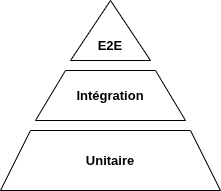

=====================================================
Workshop GN Mobile Monitoring - Tests en Flutter
=====================================================

Guide complet des tests unitaires et d'intégration
---------------------------------------------------

.. contents:: Table des matières
   :local:
   :depth: 2

Introduction
============

Ce guide détaille les pratiques de tests pour le développement mobile Flutter dans le contexte de l'application **GN Mobile Monitoring**. Il fait suite au `workshop principal <workshop_mobile_monitoring.html>`_.

.. container:: prereq-box

   **🔧 Prérequis**
   
   Avant de commencer ce tutoriel sur les tests, assurez-vous d'avoir :
   
   - Suivi le :doc:`workshop principal <workshop_mobile_monitoring>`
   - Compris l'architecture Clean Architecture
   - Un environnement Flutter fonctionnel
   - Le projet GN Mobile Monitoring installé

Pourquoi ce guide séparé ?
--------------------------

Les tests sont un sujet complexe qui mérite un traitement approfondi. Ce guide dédié permet :

- 📚 Une exploration détaillée des stratégies de test
- 🎯 Des exemples concrets adaptés au projet GN Mobile Monitoring  
- 🔧 Des patterns réutilisables pour vos propres tests
- 📈 Une progression pédagogique adaptée
Tests unitaires en Flutter
===========================

.. raw:: html

   

.. container:: info-box

   **🎯 Pourquoi les tests unitaires ?**
   
   Dans Clean Architecture, les tests unitaires sont essentiels pour valider que votre **logique métier** fonctionne correctement, indépendamment de l'interface utilisateur ou des services externes.

Introduction à la pyramide des tests
------------------------------------

*Pyramide des tests : Tests unitaires (base large) → Tests d'intégration (milieu) → Tests E2E (sommet)*

.. container:: architecture-overview

   .. container:: layer-card domain
   
      **🧪 Tests unitaires**
      
      *70% de vos tests*
      
      • Rapides (< 1 seconde)
      • Isolés (pas de dépendances)
      • Testent la logique métier
      • **Domain Layer seulement**
   
   .. container:: layer-card data
   
      **🔗 Tests d'intégration**
      
      *20% de vos tests*
      
      • Plus lents (quelques secondes)
      • Testent les interactions
      • API + Database + Cache
      • **Data Layer principalement**
   
   .. container:: layer-card presentation
   
      **📱 Tests E2E**
      
      *10% de vos tests*
      
      • Très lents (minutes)
      • Interface complète
      • Parcours utilisateur
      • **Toute l'application**

Que tester avec les tests unitaires ?
-------------------------------------

Dans le contexte GN Mobile Monitoring
~~~~~~~~~~~~~~~~~~~~~~~~~~~~~~~~~~~~~

.. admonition:: ✅ À TESTER (Domain Layer)
   :class: key-point
   
   **Use Cases** : La logique métier pure
   
   • Validation des observations (dates, coordonnées)
   • Calculs de distances ou surfaces
   • Règles de compatibilité entre modules
   • Transformation et filtrage des données
   • Validation des protocoles de monitoring
   • Règles de synchronisation (conflits, merge)
   • Calculs GPS (surfaces, distances entre sites)
   • Formatage des nomenclatures
   • Validation des formulaires dynamiques
   • Logic de cache offline
   
   **Modèles** : Les objets métier
   
   • Sérialisation/désérialisation JSON
   • Méthodes `copyWith()` générées par Freezed
   • Égalité et hashCode
   • Getters calculés et validation
   
   **Value Objects** : Objets métier immutables
   
   • Coordonnées GPS, Email, ID utilisateur
   • Validation à la création
   • Comportements métier spécifiques

.. admonition:: ❌ À NE PAS TESTER (en unitaire)
   :class: warning
   
   **Évitez de tester** :
   
   • Widgets Flutter (→ Tests de widgets séparés)
   • Appels API HTTP (→ Tests d'intégration)
   • Base de données SQLite (→ Tests d'intégration)  
   • Navigation entre écrans (→ Tests E2E)
   • Providers Riverpod (→ Tests d'intégration)

Configuration des tests dans le projet
--------------------------------------

Structure des tests
~~~~~~~~~~~~~~~~~~~

.. code-block:: text

   test/
   ├── unit/
   │   ├── domain/
   │   │   ├── model/
   │   │   │   └── observation_test.dart
   │   │   └── usecase/
   │   │       └── validate_observation_test.dart
   │   └── data/
   │       └── mapper/
   │           └── observation_mapper_test.dart
   ├── integration/
   │   └── api/
   │       └── sites_api_test.dart
   └── test_helpers/
       ├── mock_providers.dart
       └── test_data.dart

Commandes utiles
~~~~~~~~~~~~~~~~

.. code-block:: bash

   # Lancer tous les tests unitaires
   make test-unit
   # ou
   flutter test test/unit/

   # Lancer un test spécifique
   flutter test test/unit/domain/usecase/validate_observation_test.dart

   # Tests avec couverture de code
   flutter test --coverage

   # Tests en mode watch (relance automatique)
   flutter test --watch

   # Lancer les tests d'intégration (nécessite .env.test)
   make test-integration

   # Lancer TOUS les tests 
   make test-all

   # Tests avec couverture
   flutter test --coverage --exclude-tags=integration

Exemples de tests concrets
--------------------------
  Exemples de tests spécifiques au monitoring
  -------------------------------------------

  Test de validation de formulaire dynamique
  ~~~~~~~~~~~~~~~~~~~~~~~~~~~~~~~~~~~~~~~~~~~

  .. code-block:: dart
     :caption: Issu de form_config_parser_test.dart

     test('should parse conditional fields correctly', () {
       // Arrange - Configuration JSON du module
       final configJson = {
         'fields': [
           {'name': 'nb_individuals', 'type': 'number', 'required': true},
           {'name': 'sex', 'type': 'nomenclature', 'hidden': 'nb_individuals == 0'}
         ]
       };

       // Act
       final config = FormConfigParser.parse(configJson);

       // Assert
       expect(config.shouldShowField('sex', {'nb_individuals': 0}), false);
       expect(config.shouldShowField('sex', {'nb_individuals': 5}), true);
     });

  Test de logique de synchronisation
  ~~~~~~~~~~~~~~~~~~~~~~~~~~~~~~~~~~

  .. code-block:: dart
     :caption: Issu de sync_cache_manager_test.dart

     test('should handle sync conflicts correctly', () async {
       // Arrange - Données locales vs serveur
       final localVisit = Visit(id: 1, lastModified: yesterday);
       final serverVisit = Visit(id: 1, lastModified: today);
       
       // Act
       final conflict = syncManager.detectConflict(localVisit, serverVisit);
       
       // Assert
       expect(conflict.type, ConflictType.dataModified);
       expect(conflict.requiresUserChoice, true);
     });

  Test de calculs GPS terrain
  ~~~~~~~~~~~~~~~~~~~~~~~~~~~

  .. code-block:: dart
     :caption: Test spécifique aux données de terrain

     test('should calculate site area from GPS points', () {
       // Arrange - Coordonnées d'un site
       final gpsPoints = [
         GPSPoint(lat: 45.123, lng: 5.456),
         GPSPoint(lat: 45.125, lng: 5.459),
         GPSPoint(lat: 45.121, lng: 5.461),
         GPSPoint(lat: 45.123, lng: 5.456), // Fermeture du polygone
       ];
       
       // Act
       final area = SiteCalculator.calculateArea(gpsPoints);
       
       // Assert
       expect(area, closeTo(0.084, 0.01)); // ~840m² ± 10m²
     });

Test d'un Use Case avec mocks
~~~~~~~~~~~~~~~~~~~~~~~~~~~~~

**Objectif** : Tester la logique métier de façon isolée, sans dépendances externes.

.. code-block:: dart
   :linenos:
   :emphasize-lines: 14, 22-23
   :caption: test/unit/domain/usecase/validate_observation_test.dart

   import 'package:flutter_test/flutter_test.dart';
   import 'package:mockito/mockito.dart';

   void main() {
     group('ValidateObservationUseCase', () {
       late ValidateObservationUseCase useCase;

       setUp(() {
         useCase = ValidateObservationUseCase();
       });

       test('should reject future date', () async {
         // Arrange
         final futureObs = Observation(
           id: '1',
           date: DateTime.now().add(Duration(days: 1)), // ← Date future
           latitude: 45.0,
           longitude: 5.0,
         );

         // Act
         final result = await useCase.call(futureObs);

         // Assert
         expect(result.isValid, false);
         expect(result.error, contains('Date future'));
       });

       test('should reject missing coordinates', () async {
         // Arrange
         final invalidObs = Observation(
           id: '2',
           date: DateTime.now(),
           latitude: null, // ← Coordonnées manquantes
           longitude: null,
         );

         // Act
         final result = await useCase.call(invalidObs);

         // Assert
         expect(result.isValid, false);
         expect(result.error, contains('Coordonnées'));
       });

       test('should accept valid observation', () async {
         // Arrange
         final validObs = Observation(
           id: '3',
           date: DateTime.now(),
           latitude: 45.0,
           longitude: 5.0,
         );

         // Act
         final result = await useCase.call(validObs);

         // Assert
         expect(result.isValid, true);
         expect(result.error, isNull);
       });
     });
   }

Test d'un modèle Freezed
~~~~~~~~~~~~~~~~~~~~~~~~

.. code-block:: dart
   :linenos:
   :caption: test/unit/domain/model/observation_test.dart

   import 'dart:convert';
   import 'package:flutter_test/flutter_test.dart';

   void main() {
     group('Observation Model', () {
       const testObservation = Observation(
         id: '123',
         date: '2023-12-01T10:30:00Z',
         species: 'Salamandre tachetée',
         latitude: 45.123,
         longitude: 5.456,
       );

       test('should serialize to JSON correctly', () {
         // Act
         final json = testObservation.toJson();

         // Assert
         expect(json['id'], '123');
         expect(json['species'], 'Salamandre tachetée');
         expect(json['latitude'], 45.123);
       });

       test('should deserialize from JSON correctly', () {
         // Arrange
         final jsonString = '''
         {
           "id": "456",
           "date": "2023-12-02T14:15:00Z",
           "species": "Triton palmé",
           "latitude": 46.0,
           "longitude": 6.0
         }
         ''';

         // Act
         final observation = Observation.fromJson(
           jsonDecode(jsonString)
         );

         // Assert
         expect(observation.id, '456');
         expect(observation.species, 'Triton palmé');
         expect(observation.latitude, 46.0);
       });

       test('copyWith should work correctly', () {
         // Act
         final modified = testObservation.copyWith(
           species: 'Triton crêté',
           latitude: 47.0,
         );

         // Assert
         expect(modified.id, '123'); // ← Inchangé
         expect(modified.species, 'Triton crêté'); // ← Modifié
         expect(modified.latitude, 47.0); // ← Modifié
         expect(modified.longitude, 5.456); // ← Inchangé
       });

       test('equality should work correctly', () {
         // Arrange
         const identical = Observation(
           id: '123',
           date: '2023-12-01T10:30:00Z',
           species: 'Salamandre tachetée',
           latitude: 45.123,
           longitude: 5.456,
         );

         const different = Observation(
           id: '999',
           date: '2023-12-01T10:30:00Z',
           species: 'Salamandre tachetée',
           latitude: 45.123,
           longitude: 5.456,
         );

         // Assert
         expect(testObservation, equals(identical));
         expect(testObservation, isNot(equals(different)));
       });
     });
   }

Test d'un Repository avec mocks
~~~~~~~~~~~~~~~~~~~~~~~~~~~~~~~

.. code-block:: dart
   :linenos:
   :emphasize-lines: 8, 18, 27
   :caption: test/unit/domain/usecase/get_sites_test.dart

   import 'package:flutter_test/flutter_test.dart';
   import 'package:mockito/mockito.dart';
   import 'package:mockito/annotations.dart';

   // Génère automatiquement MockSitesRepository
   @GenerateMocks([SitesRepository])
   void main() {
     late MockSitesRepository mockRepository;
     late GetSitesUseCase useCase;

     setUp(() {
       mockRepository = MockSitesRepository();
       useCase = GetSitesUseCase(mockRepository);
     });

     group('GetSitesUseCase', () {
       test('should return sites from repository', () async {
         // Arrange - Mock du comportement
         final expectedSites = [
           Site(id: 1, name: 'Site A', coordinates: [45.0, 5.0]),
           Site(id: 2, name: 'Site B', coordinates: [46.0, 6.0]),
         ];
         when(mockRepository.getSites('POPAAMPHIBIEN'))
             .thenAnswer((_) async => expectedSites);

         // Act
         final result = await useCase.call('POPAAMPHIBIEN');

         // Assert
         expect(result, expectedSites);
         verify(mockRepository.getSites('POPAAMPHIBIEN')).called(1);
       });

       test('should handle repository error', () async {
         // Arrange
         when(mockRepository.getSites(any))
             .thenThrow(Exception('Network error'));

         // Act & Assert
         expect(
           () => useCase.call('POPAAMPHIBIEN'),
           throwsA(isA<Exception>()),
         );
       });
     });
   }

Bonnes pratiques pour les tests
-------------------------------

Structure AAA (Arrange-Act-Assert)
~~~~~~~~~~~~~~~~~~~~~~~~~~~~~~~~~~

.. admonition:: 📝 Pattern AAA
   :class: key-point
   
   **Arrange** : Préparer les données et mocks
   
   **Act** : Exécuter la fonction à tester
   
   **Assert** : Vérifier le résultat attendu

.. code-block:: dart

   test('should calculate distance correctly', () {
     // Arrange ← 🔧 Préparation
     final pointA = Coordinate(45.0, 5.0);
     final pointB = Coordinate(45.1, 5.1);
     
     // Act ← ⚡ Exécution
     final distance = calculateDistance(pointA, pointB);
     
     // Assert ← ✅ Vérification
     expect(distance, closeTo(15.7, 0.1)); // ~15.7km ± 0.1
   });

Nommage des tests
~~~~~~~~~~~~~~~~

.. code-block:: dart

   // ✅ BON - Décrit le comportement
   test('should return empty list when no observations found')
   test('should throw exception when user is not authenticated')
   test('should validate email format correctly')

   // ❌ MAUVAIS - Trop vague
   test('test login')
   test('check email') 
   test('repository test')

Gestion des mocks
~~~~~~~~~~~~~~~~

.. code-block:: bash

   # Générer automatiquement les mocks
   flutter packages pub run build_runner build

.. code-block:: dart

   // Dans le fichier de test
   @GenerateMocks([
     SitesRepository,
     AuthRepository, 
     DatabaseProvider,
   ])

Couverture de code
~~~~~~~~~~~~~~~~~

.. code-block:: bash

   # Générer un rapport de couverture
   flutter test --coverage
   
   # Voir le rapport dans un navigateur
   genhtml coverage/lcov.info -o coverage/html
   open coverage/html/index.html

.. tip::
   🎯 **Objectif couverture** : Visez 80%+ pour le Domain Layer, moins critique pour Presentation/Data.

Debugging des tests
~~~~~~~~~~~~~~~~~~

.. code-block:: dart

   test('debug example', () async {
     // Afficher des valeurs pendant le test
     print('Value: $result');
     
     // Débugger avec le debugger
     debugger(); // Pause ici si lancé avec --enable-vm-service
     
     expect(result, isNotNull);
   });

.. code-block:: bash

   # Lancer les tests avec debug
   flutter test --enable-vm-service test/unit/specific_test.dart

Intégration dans le workflow de développement
--------------------------------------------

TDD (Test-Driven Development)
~~~~~~~~~~~~~~~~~~~~~~~~~~~~

.. admonition:: 🔄 Cycle TDD
   :class: key-point
   
   1. **🔴 RED** : Écrire un test qui échoue
   2. **🟢 GREEN** : Écrire le minimum de code pour passer le test  
   3. **🔵 REFACTOR** : Améliorer le code tout en gardant les tests verts

.. code-block:: dart

   // 1. RED - Test qui échoue
   test('should calculate tax correctly', () {
     final calculator = TaxCalculator();
     expect(calculator.calculate(100), 20.0); // 20% TVA
   }); // ← Classe TaxCalculator n'existe pas encore

   // 2. GREEN - Code minimal qui marche
   class TaxCalculator {
     double calculate(double amount) => amount * 0.2;
   }

   // 3. REFACTOR - Améliorer sans casser
   class TaxCalculator {
     final double _taxRate;
     TaxCalculator(this._taxRate);
     
     double calculate(double amount) {
       if (amount < 0) throw ArgumentError('Amount cannot be negative');
       return amount * _taxRate;
     }
   }

Hooks Git (pre-commit)
~~~~~~~~~~~~~~~~~~~~~

.. code-block:: bash

   # .git/hooks/pre-commit
   #!/bin/sh
   echo "Running unit tests..."
   flutter test test/unit/ || exit 1
   echo "All tests passed!"

CI/CD Integration
~~~~~~~~~~~~~~~~

Le projet utilise GitHub Actions pour l'automatisation des tests :

.. code-block:: yaml
   :caption: .github/workflows/integration_tests.yml

   name: Integration Tests
   on:
     push:
       branches: [main, develop]
     pull_request:
       branches: [main, develop]
     workflow_dispatch: # Exécution manuelle

   jobs:
     # Tests unitaires (rapides, toujours exécutés)  
     unit-tests:
       runs-on: ubuntu-latest
       timeout-minutes: 10
       steps:
         - uses: actions/checkout@v3
         - uses: subosito/flutter-action@v2
           with:
             flutter-version: '3.22.3'
         - run: flutter pub get
         - run: flutter pub run build_runner build --delete-conflicting-outputs
         - run: flutter analyze --no-fatal-infos
         - run: flutter test --exclude-tags=integration --coverage
         - uses: codecov/codecov-action@v3

     # Tests d'intégration (avec serveur réel)
     integration-tests:
       runs-on: ubuntu-latest
       timeout-minutes: 20
       needs: unit-tests
       # Seulement sur main/develop ou exécution manuelle
       if: github.ref == 'refs/heads/main' || github.ref == 'refs/heads/develop' || github.event_name == 'workflow_dispatch'
       steps:
         - uses: actions/checkout@v3
         - uses: subosito/flutter-action@v2
         - run: flutter pub get
         - run: flutter pub run build_runner build --delete-conflicting-outputs
         - name: Run integration tests
           env:
             TEST_SERVER_URL: ${{ secrets.TEST_SERVER_URL }}
             TEST_USERNAME: ${{ secrets.TEST_USERNAME }}
             TEST_PASSWORD: ${{ secrets.TEST_PASSWORD }}
             TEST_MODULES: ${{ secrets.TEST_MODULES }}
           run: flutter test test/integration/ --tags=integration --reporter=expanded

Tests de ViewModels avec Riverpod
~~~~~~~~~~~~~~~~~~~~~~~~~~~~~~~~~~~

**Objectif** : Tester la logique de présentation et gestion d'état avec Riverpod.

.. code-block:: dart
   :linenos:
   :caption: test/presentation/viewmodel/modules_utilisateur_viewmodel_test.dart

   import 'package:flutter_riverpod/flutter_riverpod.dart';
   import 'package:flutter_test/flutter_test.dart';
   import 'package:mocktail/mocktail.dart';

   void main() {
     late ProviderContainer container;
     late MockGetModulesUseCase mockGetModulesUseCase;

     setUp(() {
       mockGetModulesUseCase = MockGetModulesUseCase();
       container = ProviderContainer(
         overrides: [
           getModulesUseCaseProvider.overrideWithValue(mockGetModulesUseCase),
         ],
       );
     });

     tearDown(() => container.dispose());

     test('should load modules and update state correctly', () async {
       // Arrange
       final mockModules = [
         const Module(
           id: 1,
           moduleCode: 'POPAAMPHIBIEN',
           moduleLabel: 'Population Amphibiens',
           downloaded: true,
         ),
         const Module(
           id: 2,
           moduleCode: 'POPREPTILE',
           moduleLabel: 'Population Reptiles',
           downloaded: false,
         ),
       ];

       when(() => mockGetModulesUseCase.execute())
           .thenAnswer((_) async => mockModules);

       // Act
       final viewModel = container.read(userModuleViewModelProvider.notifier);
       await viewModel.loadModules();

       // Assert
       final state = container.read(userModuleViewModelProvider);
       expect(state.data!.values.length, equals(2));
       expect(state.data!.values[0].downloadStatus, 
              equals(ModuleDownloadStatus.moduleDownloaded));
       expect(state.data!.values[1].downloadStatus,
              equals(ModuleDownloadStatus.moduleNotDownloaded));
     });
   }

Tests de Widgets Flutter
~~~~~~~~~~~~~~~~~~~~~~~~~

**Objectif** : Tester l'interface utilisateur et les interactions.

.. code-block:: dart
   :linenos:
   :caption: test/presentation/view/taxon_selector_widget_test.dart

   import 'package:flutter/material.dart';
   import 'package:flutter_test/flutter_test.dart';
   import 'package:gn_mobile_monitoring/presentation/widgets/taxon_selector_widget.dart';

   void main() {
     final testTaxons = [
       Taxon(cdNom: 1, nomComplet: "Salamandra salamandra", 
             lbNom: "Salamandre tachetée", nomVern: "Salamandre"),
       Taxon(cdNom: 2, nomComplet: "Triturus cristatus",
             lbNom: "Triton crêté", nomVern: "Triton"),
     ];

     group('TaxonSelectorWidget Tests', () {
       testWidgets('should show search placeholder initially', (tester) async {
         // Arrange & Act
         await tester.pumpWidget(MaterialApp(
           home: Scaffold(
             body: TaxonSelectorWidget(
               moduleId: 123,
               onChanged: (_) {},
               label: 'Sélectionner un taxon',
             ),
           ),
         ));
         
         // Assert
         expect(find.text('Rechercher un taxon...'), findsOneWidget);
         expect(find.byIcon(Icons.search), findsOneWidget);
       });

       testWidgets('should display selected taxon', (tester) async {
         // Arrange
         await tester.pumpWidget(MaterialApp(
           home: TaxonSelectorWidget(
             moduleId: 123,
             value: 1,  // Taxon pré-sélectionné
             onChanged: (_) {},
           ),
         ));

         // Act
         await tester.pumpAndSettle();

         // Assert
         expect(find.text('Salamandre (Salamandre tachetée)'), findsOneWidget);
         expect(find.byIcon(Icons.clear), findsOneWidget);
       });

       testWidgets('should clear selection when clear button tapped', (tester) async {
         // Arrange
         await tester.pumpWidget(/* widget avec value: 1 */);
         await tester.pumpAndSettle();

         // Act
         await tester.tap(find.byIcon(Icons.clear));
         await tester.pumpAndSettle();

         // Assert
         final textField = tester.widget<TextFormField>(find.byType(TextFormField));
         expect(textField.controller!.text, '');
         expect(find.byIcon(Icons.search), findsOneWidget);
       });
     });
   }

Tests d'intégration
~~~~~~~~~~~~~~~~~~~

**Objectif** : Tester les flux complets avec un serveur réel.

.. code-block:: dart
   :caption: test/integration/tests/01_auth_integration_test.dart

   @Tags(['integration'])
   void main() {
     late TestServerConfig config;

     setUpAll(() async {
       // Charger configuration depuis .env.test
       config = await TestEnvironmentSetup.getConfig();
     });

     test('should authenticate against real GeoNature server', () async {
       // Arrange
       final authRepo = AuthenticationRepositoryImpl();

       // Act
       final result = await authRepo.login(
         email: config.username,
         password: config.password,
       );

       // Assert
       expect(result.isSuccess, true);
       expect(result.token, isNotEmpty);
       expect(result.user.email, equals(config.username));
     });

     test('should fetch modules after authentication', () async {
       // Arrange
       await AuthHelper.loginWithTestConfig(config);
       final modulesRepo = ModulesRepositoryImpl();

       // Act
       final modules = await modulesRepo.getModules();

       // Assert
       expect(modules, isNotEmpty);
       expect(modules.any((m) => m.moduleCode == 'POPAAMPHIBIEN'), true);
       expect(modules.any((m) => m.moduleCode == 'POPREPTILE'), true);
     });
   }

Configuration des tests d'intégration
~~~~~~~~~~~~~~~~~~~~~~~~~~~~~~~~~~~~~~

.. code-block:: bash
   :caption: .env.test (Configuration requise)

   # Serveur GeoNature de test
   TEST_SERVER_URL=https://geonature-test.reservenaturelle.fr
   TEST_USERNAME=antoine.schlegel
   TEST_PASSWORD=antoine
   TEST_MODULES=POPAAMPHIBIEN,POPREPTILE

Exécution
~~~~~~~~~

.. code-block:: bash

   # Tests unitaires uniquement
   make test-unit
   # ou
   flutter test --exclude-tags=integration

   # Tests d'intégration uniquement  
   make test-integration
   # ou
   flutter test test/integration/ --tags=integration

   # Tous les tests
   make test-all
   # ou
   flutter test

Configuration des tests d'intégration
-------------------------------------

Variables d'environnement requises
~~~~~~~~~~~~~~~~~~~~~~~~~~~~~~~~~~~

.. code-block:: bash
   :caption: .env.test (copier depuis .env.test.example)

   # Serveur GeoNature de test
   GEONATURE_API_URL=https://demo.geonature.fr
   TEST_USERNAME=test@geonature.fr
   TEST_PASSWORD=password

   # Module de test
   TEST_MODULE_CODE=POPAAMPHIBIEN
   TEST_SITE_GROUP_ID=1

Tags de tests
~~~~~~~~~~~~~

.. code-block:: dart

   @Tags(['integration'])
   void main() {
      group('Sites API Integration', () {
      // Tests nécessitant un serveur réel
      });
   }

Tests d'intégration spécifiques
-------------------------------

Configuration du serveur de test
~~~~~~~~~~~~~~~~~~~~~~~~~~~~~~~~

.. admonition:: 🔧 Setup intégration
   :class: key-point

   Avant de lancer les tests d'intégration :

   1. Copiez ``.env.test.example`` vers ``.env.test``
   2. Configurez les credentials du serveur de test
   3. Assurez-vous que le serveur GeoNature est accessible
   4. Lancez : ``make test-integration``

.. code-block:: dart
   :caption: test/integration/auth_integration_test.dart

   @Tags(['integration'])
   group('Authentication Integration', () {
      test('should authenticate against real server', () async {
      // Utilise les vraies API GeoNature
      final authRepo = AuthenticationRepositoryImpl();
      final result = await authRepo.login(
         email: testConfig.username,
         password: testConfig.password,
      );

      expect(result.isSuccess, true);
      expect(result.token, isNotEmpty);
      });
   });

Métriques du projet GN Mobile Monitoring
-----------------------------------------

.. container:: metrics-grid

   **📊 Tests actuels** (novembre 2024)

   • **Tests unitaires** : ~80 fichiers de test
   • **Tests d'intégration** : 5 tests configurés avec serveur réel  
   • **Tests de widgets** : 20+ widgets testés (formulaires, sélecteurs)
   • **Tests de ViewModels** : Riverpod providers avec mocks
   • **Coverage Domain** : ~85% (use cases bien testés)
   • **Coverage Data** : ~70% (repositories et mappers)
   • **Coverage Presentation** : ~60% (widgets et viewmodels)

Structure réelle des tests
~~~~~~~~~~~~~~~~~~~~~~~~~~

Le projet suit cette organisation de tests :

.. code-block:: text

   test/
   ├── core/                          # Tests utilitaires & helpers
   │   └── helpers/                   # 12 fichiers de test (parsers, formatters)
   ├── data/                          # Tests couche Data (mocks)
   │   ├── datasource/               # Tests API et Database
   │   └── repository/               # 10+ repositories testés
   ├── domain/                       # Tests couche Domain (unitaires)
   │   ├── model/                    # Tests modèles Freezed
   │   ├── usecase/                  # 40+ use cases testés
   │   └── viewmodel/                # Tests ViewModels
   ├── presentation/                 # Tests couche Presentation
   │   ├── view/                     # Tests pages et widgets
   │   ├── viewmodel/                # Tests state management
   │   └── widgets/                  # Tests composants UI
   ├── integration/                  # Tests d'intégration
   │   ├── config/                   # Configuration serveur test
   │   ├── helpers/                  # Helpers auth & données test
   │   └── tests/                    # Tests avec serveur réel
   └── mocks/                        # Mocks partagés

Spécificités GN Mobile Monitoring
~~~~~~~~~~~~~~~~~~~~~~~~~~~~~~~~~

Les tests couvrent les fonctionnalités critiques :

**Authentification & Session**
   • Login/logout avec serveur GeoNature
   • Gestion token JWT et persistance  
   • Tests avec vraies API (tests d'intégration)

**Synchronisation de données**
   • Upload observations/visites vers serveur
   • Download modules, sites, taxonomie
   • Gestion conflits et résolution automatique

**Formulaires dynamiques terrain** 
   • Parsing configuration JSON modules
   • Validation champs conditionnels (expressions JS)
   • Tests widgets nomenclatures et taxonomie

**Données géographiques**
   • Calculs GPS (surfaces, distances)
   • Validation coordonnées et zones
   • Tests intégration cartes

**Tests avec serveur réel**
   • Serveur : `geonature-test.reservenaturelle.fr`
   • Modules : POPAAMPHIBIEN, POPREPTILE
   • CI/CD GitHub Actions avec secrets

Ressources pour aller plus loin
===============================

Documentation officielle
------------------------

- **Flutter Testing** : https://docs.flutter.dev/testing
- **Mockito** : https://pub.dev/packages/mockito
- **Integration Testing** : https://docs.flutter.dev/testing/integration-tests
- **Coverage** : https://docs.flutter.dev/testing/coverage

Ressources GeoNature
--------------------

- **Repository GN Mobile** : https://github.com/RNF-SI/gn_mobile_monitoring
- **Issues et discussions** : https://github.com/RNF-SI/gn_mobile_monitoring/issues
- **Documentation API GeoNature** : https://docs.geonature.fr/

Prochaines étapes
-----------------

Après avoir maîtrisé les tests :

1. **Contribuer au projet** : Améliorer la couverture de tests
2. **TDD en pratique** : Développer une nouvelle feature en TDD
3. **CI/CD** : Configurer l'intégration continue sur vos projets
4. **Tests E2E** : Explorer les tests d'interface avec Flutter Driver

----

*Retour au* :doc:`workshop principal <workshop_mobile_monitoring>`

